## Kubernetes (K8s)

# How Docker and Kubernetes Work Together?
* refer here: https://www.geeksforgeeks.org/docker-kubernetes-architecture/
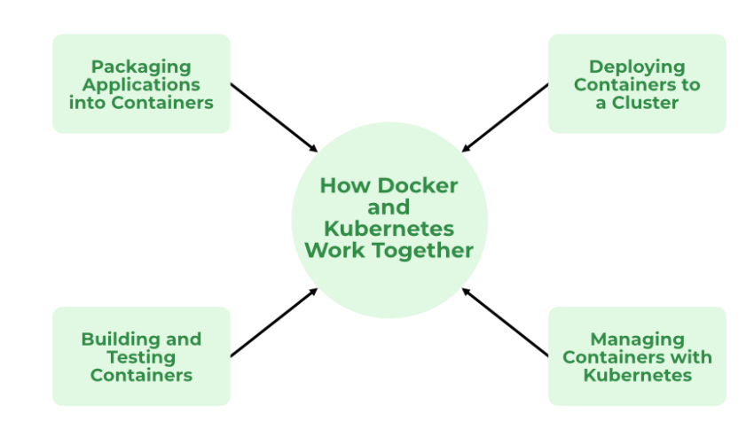

#                            -----Kubernetes (K8s)-----

* refer here: https://kubernetes.io/
* Kuberentes is an open source container orchestration platform developed by Google and Donated to CNCF Refer Here: https://www.cncf.io/projects/
* Google has history of running containerized applications, to manage these containers google has the following internal projects
      * omega 
      * borg
* With the understanding of container orchestrations and experience in dealing with heavily scaled containers, google started building a project in golang called as kubernetes (k8s)
* In the very initial days, k8s was developed to run docker contianers. To make docker work with k8s, google has written to much of code to bridge the gap.
* Now k8s runs other containers as well
* k8s has stopped supporting docker Refer Here: https://kubernetes.io/blog/2020/12/02/dont-panic-kubernetes-and-docker/

* ## Need for K8s
  
* High Availability (HA):
      * When we run our applications in docker container and if the container fails, we need to manually start the container
      * If the node i.e. the machine fails all the containers running on the machine should be re-created on other machine
      * K8s can do both of the above

* Autoscaling

      * Containers don’t scale on their own.
      * Scaling is of two types
           * Vertical Scaling = in that you increase ram,cpu sizes
           * Horizontal Scaling = in that you increasing no. of container 
      * K8s can do both horizontal and vertical scaling of containers

* Zero-Down time Deployments

      * k8s can handle deployments with near zero-down time deployments
      * K8s can handle rollout (new version) and roll back (undo new version => previous version)

* __K8s is described as Production grade Container management__
  
* ## History

* Google had a history of running everything on containers.
* To manage these containers, Google has developed container management tools (inhouse)
      * Borg
      * Omega

* With Docker publicizing containers, With the experience in running and managing containers, Google has started a project Kubernetes (developed in Go) and then handed it over to Cloud Native Container Foundation (CNCF)

* # Competetiors

* Apache Mesos
* Hashicorp Nomad
* Docker Swarm
* But K8s is clear winner

* # Terms

* # Distributed System 
                      = in Distributed System there is no server or client or any thing become client or server.
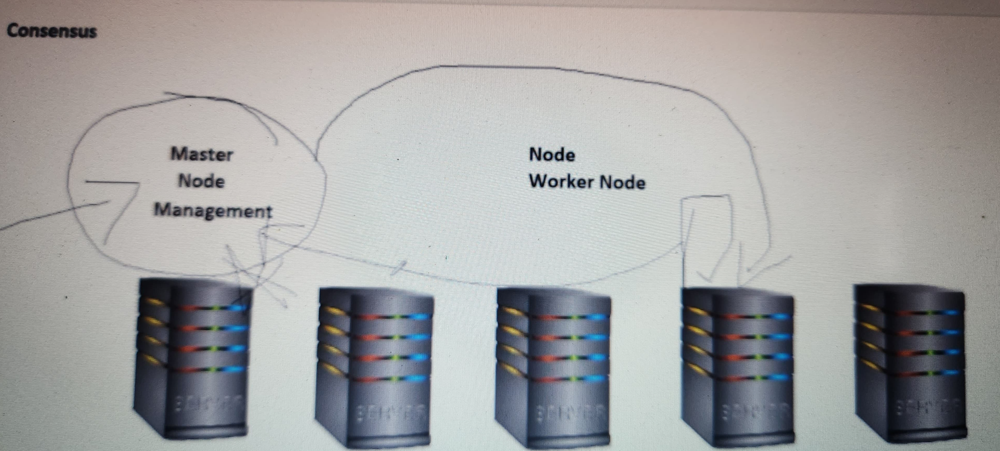

* # Node
                       = A Node is a worker machine in Kubernetes and may be either a virtual or a physical machine, depending on the cluster. Each Node is managed by the control plane. A Node can have multiple pods, and the Kubernetes control plane automatically handles scheduling the pods across the Nodes in the cluster.
* # Cluster 
                       = cluster is a combination of multiple machine or * Work is running application in a docker container.
* what is node and cluster?
                       = so we want to run docker container in production so for that we needs lots of server where docker installed , consider that to be a __node__.
to speak to that cluster we need some way of communication that is __client__.

* # State
                       = state is some meaningful information about your application or any things

* Stateful Applications
                       = stateful applications are the which stores the date somewere in the local systems.

* Stateless Applications
                       = A system is stateless when it doesn't need to store any data within itself. Its store the data in database 

* # Monolith 
                      = Monolithic in general is something that is a single large block, indivisible, inflexible, and moveable. or refer here: https://www.geeksforgeeks.org/kubernetes-monolithic-architecture-of-kubernetes/ 
                      Monolith is not deffinety is smallest server. Monolith is running your whole of application as of it is one huge component, so running whole Ecommerce in one server or Designing whole Ecommerce in one server. 
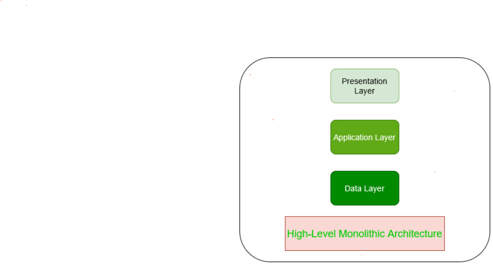 

* # Microservices 
                      = you break that huge service into small component based on its functionality or based on the request or based on your domain so then becomes a microservice. 
                      refer here= https://goteleport.com/blog/microservices-containers-kubernetes/                  

* # Desired State
                      = In Kubernetes, the desired state is how your infrastructure or application should function once running. The controller is the HVAC equipment — all the mysterious machinery that gets you from 0 to desired state. The temperature you set is your configuration. 
                      in k8s always we speak what is that we want so that is basically called as Desired State. what is that your application wants.
                      where you tell Kubernetes i want to run mysql container or i want to have or run 3 mysql container

# Since k8s can manage container it can basically create those containers it can do configurations what we ask for running this we have 2 ways

* # Declarative 
                      = You try to write a manifest file or manifest file is nothing but its a yaml file. Writting a Docker compose is Declarative way .   
* # Imperative
                       = It means you type commands , manually running a commands to create a NopCommerce is a Imperative way. 

* # What is k8s ?      
                      = k8s is production grade container management , once your application has container k8s can do what is necessary to take your container techonolgy into production where n no. of user can basically use your application.  
                      
                      what is requrire to run your container 
                      what is necessary for you to tell work to the cluster 

* # Pet Vs Cattle

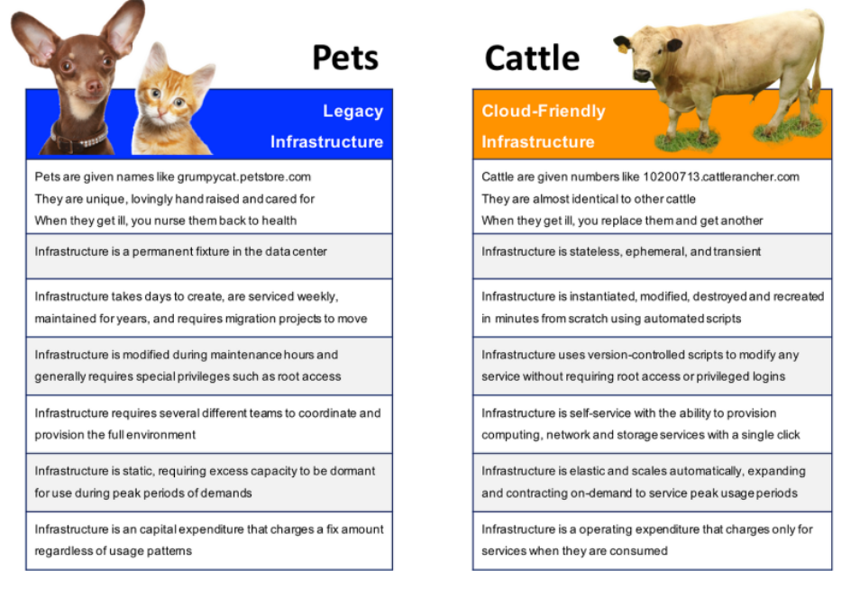

* # K8s is not design only for Docker 
    
    * Initially k8s used Docker as a main container platform and docker used to get special treatment , from k8s 1.24 special treatment is stopped.
    * k8s is designed to run any container technology, for this k8s expect container technology to follow k8s interfaces.

* # k8s Architecture

* offical architecture image
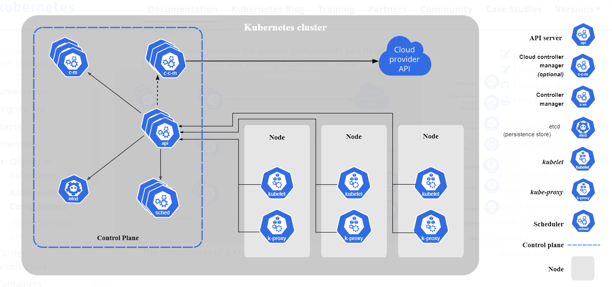
* refer here : https://kubernetes.io/docs/concepts/overview/components/

* Other easier representations
* # Master node 

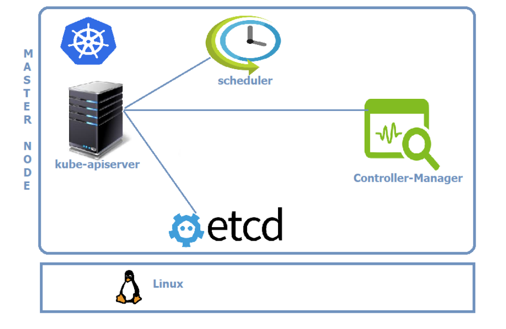

* # Node

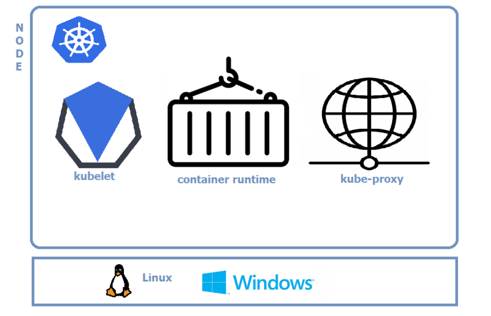
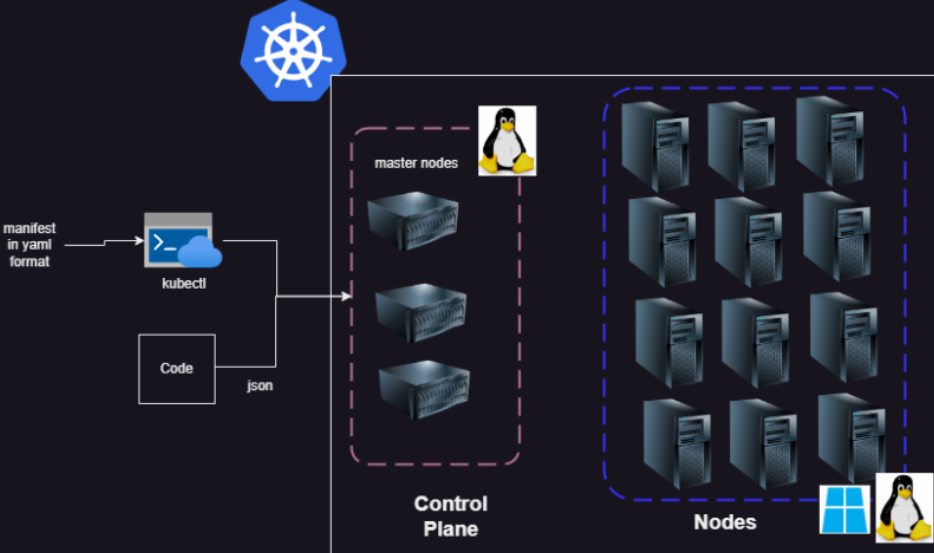

* Clients 
   
   * kubectl 
   * any rest based client 

* Logical view 
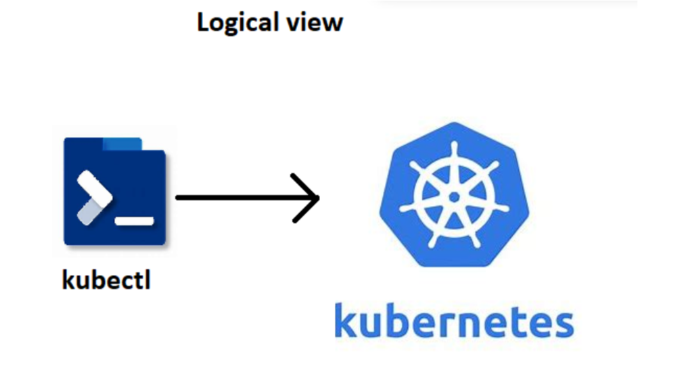

* Actual view

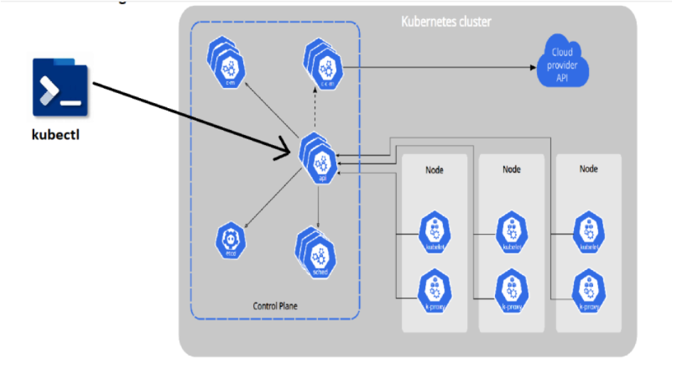

* # Kuberenets Components 

* Refer here: https://kubernetes.io/docs/concepts/overview/components/
* refer here: https://directdevops.blog/2019/10/10/kubernetes-master-and-node-components/#google_vignette

* Control planes components (MAster Node Components)
     * kube-api server 
     * etcd (*)
     * kube-scheduler
     * controller manager
     * cloud control maneger  

* Node Components 
     * kubelet 
     * kube-proxy 
     * container run time (*)

* # kube-api server 
     * Handells all the communication of k8s cluster 
     * Let it be internal or external
     * kube-api server exposes functionality over HTTPs protocol and provides REST API

* # etcd 
     * refer here: https://etcd.io/
     * This is memory of k8s cluster 

* # scheduler 
     * scheduler is responsible for creating k8s objects and scheduling them on right node 

* # controller 
     * Controller manger is resposible for maintaining desired state
     * This reconcilation loop that checks for desired state and if it mis matches doing the necessary steps is done by controller 

* # kubelet 
     * This is the agent of control plane 

* # Container runtime 
     * container technology to be used in k8s cluster 
     * in our case it is docker   

* # Kube-proxy 
     * This kube-proxy component is resposible for networking for containers on the node 

* # kubectl 
     * This is commmand line that can be installed on the machine from which you communicate to k8s cluster.
     * This tool is created to make communication with api-server smiplified.
     * Kubectl has a config file (KUBECONFIG) which contains 
           * api-server information
           * keys to communicate with api server  
     * kubectl allows to communication with cluster to create resources 
           * imperatively : type commands
           * declartively : Write manifests (YAML files)
     * Reads manifests and connects to api server. Converts the manifests into REST API calls over Json
     * SDKS: client libraries in different programming languages
     * options for bringing up the k8s clusters 
           
           * __self hosted__ 
              * we have to create servers 
              * configure servers as master nodes and nodes 
              * installation/upgrades will be done by us
           * __cloud hosted__ k8s as a service 
              * K8s as a service means control plane will be managed by cloud (they charge hourly for this)
              * Nodes can be added by us just by specifying the number or auto scaled. These server price will be normal vm charges.

* # What is k8s manifests
     * This is a yaml file which describe the desired state of what you want in/using k8s cluster 

* # CI/CD workflow
     * Basic workflow
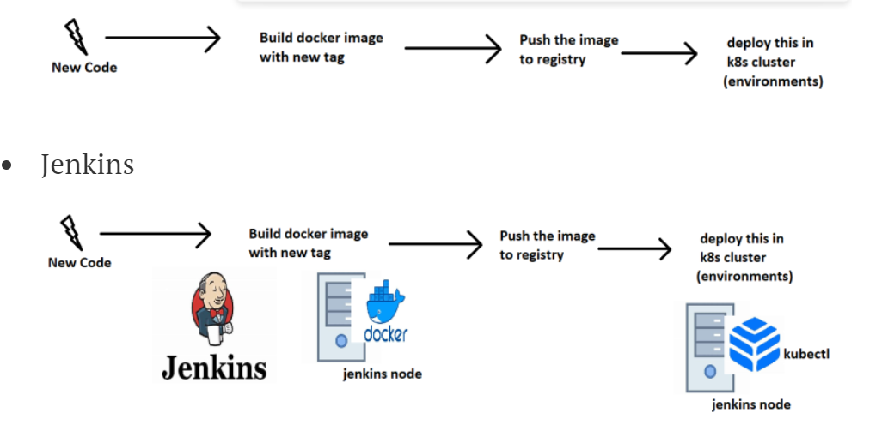

* # Azure Devops 

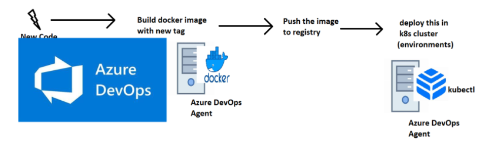

* # IDEAL K8s HA CLUSTER 

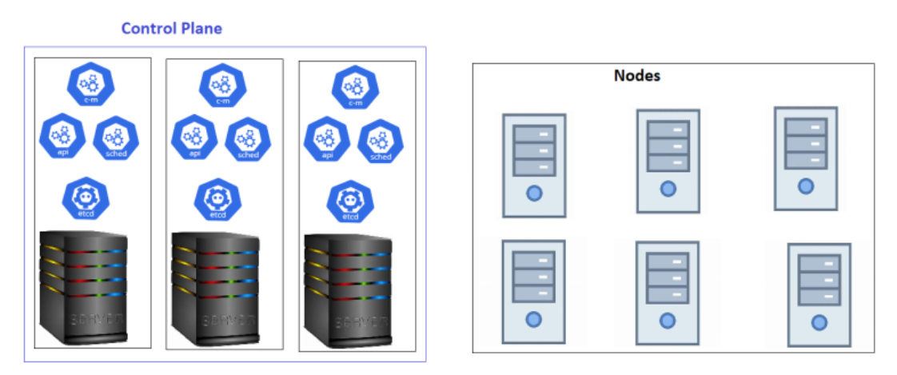

* # Kubernetes as a service 

* All popular clouds are offering k8s as a service
    * AKS (Azure kuberenets service)
    * EKS (Elastic k8s service)   = Amazon
    * GKS (Google K8s service)
* All cloud providers manage control plane for you and charge hourly. For nodes we pay the similar costs of virtual machines. 

* # k8s Installations 
    * Single Node Installations
        * minikube
        * kind  
    * On-prem Installations
        * kube-admin  
    * k8s as a service 
        * AKS
        * EKS
        * GKS
* Playground for learning , Refer here: https://labs.play-with-k8s.com/ 
* 
