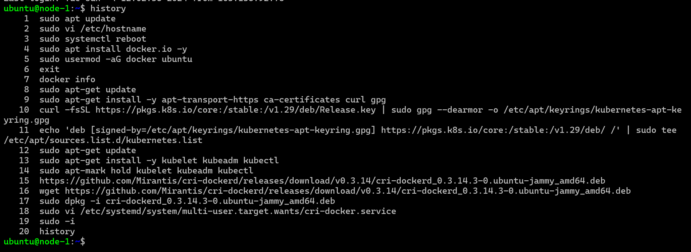

## Kubernetes (K8s)

# How Docker and Kubernetes Work Together?
* refer here: https://www.geeksforgeeks.org/docker-kubernetes-architecture/


#                            -----Kubernetes (K8s)-----

* refer here: https://kubernetes.io/
* Kuberentes is an open source container orchestration platform developed by Google and Donated to CNCF Refer Here: https://www.cncf.io/projects/
* Google has history of running containerized applications, to manage these containers google has the following internal projects
      * omega 
      * borg
* With the understanding of container orchestrations and experience in dealing with heavily scaled containers, google started building a project in golang called as kubernetes (k8s)
* In the very initial days, k8s was developed to run docker contianers. To make docker work with k8s, google has written to much of code to bridge the gap.
* Now k8s runs other containers as well
* k8s has stopped supporting docker Refer Here: https://kubernetes.io/blog/2020/12/02/dont-panic-kubernetes-and-docker/

* ## Need for K8s
  
* High Availability (HA):
      * When we run our applications in docker container and if the container fails, we need to manually start the container
      * If the node i.e. the machine fails all the containers running on the machine should be re-created on other machine
      * K8s can do both of the above

* Autoscaling

      * Containers don’t scale on their own.
      * Scaling is of two types
           * Vertical Scaling = in that you increase ram,cpu sizes
           * Horizontal Scaling = in that you increasing no. of container 
      * K8s can do both horizontal and vertical scaling of containers

* Zero-Down time Deployments

      * k8s can handle deployments with near zero-down time deployments
      * K8s can handle rollout (new version) and roll back (undo new version => previous version)

* __K8s is described as Production grade Container management__
  
* ## History

* Google had a history of running everything on containers.
* To manage these containers, Google has developed container management tools (inhouse)
      * Borg
      * Omega

* With Docker publicizing containers, With the experience in running and managing containers, Google has started a project Kubernetes (developed in Go) and then handed it over to Cloud Native Container Foundation (CNCF)

* # Competetiors

* Apache Mesos
* Hashicorp Nomad
* Docker Swarm
* But K8s is clear winner

* # Terms

* __Distributed System__
                      = in Distributed System there is no server or client or any thing become client or server.


* __Node__
                       = node = what is requrire to run your container? 
                       = cluster = what is necessary for you to tell work to the cluster?
                        A Node is a worker machine in Kubernetes and may be either a virtual or a physical machine, depending on the cluster. Each Node is managed by the control plane. A Node can have multiple pods, and the Kubernetes control plane automatically handles scheduling the pods across the Nodes in the cluster.
* __Cluster__
                       = cluster is a combination of multiple machine or A Kubernetes cluster is a set of nodes that run containerized applications.
                        Work is running application in a docker container.
* __what is node and cluster?__
                       = so we want to run docker container in production so for that we needs lots of server where docker installed , consider that to be a __node__.
to speak to that cluster we need some way of communication that is __client__.

* __State__
                       = state is some meaningful information about your application or any things

* __Stateful Applications__
                       = stateful applications are the which stores the date somewere in the local systems.

* __Stateless Applications__
                       = A system is stateless when it doesn't need to store any data within itself. Its store the data in database 

* __Monolith__
                      = Monolithic in general is something that is a single large block, indivisible, inflexible, and moveable. or refer here: https://www.geeksforgeeks.org/kubernetes-monolithic-architecture-of-kubernetes/ 
                      Monolith is not deffinety is smallest server. Monolith is running your whole of application as of it is one huge component, so running whole Ecommerce in one server or Designing whole Ecommerce in one server. 
 

* __Microservices__ 
                      = you break that huge service into small component based on its functionality or based on the request or based on your domain so then becomes a microservice. 
                      refer here= https://goteleport.com/blog/microservices-containers-kubernetes/                  

* __Desired State__
                      = In Kubernetes, the desired state is how your infrastructure or application should function once running. The controller is the HVAC equipment — all the mysterious machinery that gets you from 0 to desired state. The temperature you set is your configuration. 
                      in k8s always we speak what is that we want so that is basically called as Desired State. what is that your application wants.
                      where you tell Kubernetes i want to run mysql container or i want to have or run 3 mysql container

# Since k8s can manage container it can basically create those containers it can do configurations what we ask for running this we have 2 ways

* __Declarative__ 
                      = You try to write a manifest file or manifest file is nothing but its a yaml file. Writting a Docker compose is Declarative way .   
* __Imperative__
                       = It means you type commands , manually running a commands to create a NopCommerce is a Imperative way. 

* __What is k8s ?__      
                      = k8s is production grade container management , once your application has container k8s can do what is necessary to take your container techonolgy into production where n no. of user can basically use your application.

* __Pet Vs Cattle__


* # K8s is not design only for Docker 
    
    * Initially k8s used Docker as a main container platform and docker used to get special treatment , from k8s 1.24 special treatment is stopped.
    * k8s is designed to run any container technology, for this k8s expect container technology to follow k8s interfaces.

* # k8s Architecture

* offical architecture image

* refer here : https://kubernetes.io/docs/concepts/overview/components/

* Other easier representations
* # Master node 


* # Node


* Clients 
   
   * kubectl 
   * any rest based client 

* Logical view 


* Actual view


* # Kuberenets Components 

* Refer here: https://kubernetes.io/docs/concepts/overview/components/
* refer here: https://directdevops.blog/2019/10/10/kubernetes-master-and-node-components/#google_vignette

* Control planes components (MAster Node Components)
     * kube-api server 
     * etcd (*)
     * kube-scheduler
     * controller manager
     * cloud control maneger  

* Node Components 
     * kubelet 
     * kube-proxy 
     * container run time (*)

* # kube-api server 
     * Handells all the communication of k8s cluster 
     * Let it be internal or external
     * kube-api server exposes functionality over HTTPs protocol and provides REST API
     * kubeapsi serve is a stateless 
* # etcd 
     * when k8s was being develpoed to store the state of k8s we need some database, what is state of k8s,how many nodes are there how many containers did you create, what are its configuration anything that k8s has stored somewhere and that somewhere is __etcd__ 
     * refer here: https://etcd.io/
     * This is memory of k8s cluster 
     * etcd is statefull
* # scheduler 
     * scheduler is responsible for creating k8s objects and scheduling them on right node 

* # controller 
     * Controller manger is resposible for maintaining desired state
     * controller is a watchdog it is that loop that runs the all time e.g: you want to run 3 mysql containers, this controller is always check whethere 3 are running or not you asked for 3 but 2 are present then controller will figure out desired state is 3 but the actuall state is 2 so i need to create 1 more container.
     * This reconcilation loop that checks for desired state and if it mis matches doing the necessary steps is done by controller 
     * refer here:https://directdevops.blog/2019/10/10/kubernetes-master-and-node-components/

* # kubelet 
     * This is the agent of control plane on every node 
     * it listen what control plane has to says, create a new container so it will do what is necessary for you. So any work that has been done on the node is handle by __kubelet__ .
     * so kublete is agent of k8s control plane on every node , to listen to the instruction from contol plane that is agent of k8s cluster.

* # Container runtime 
     * container technology to be used in k8s cluster 
     * in our case it is docker   

* # Kube-proxy 
     * This kube-proxy component is resposible for networking for containers on the node 

* # kubectl 
     * This is commmand line that can be installed on the machine from which you communicate to k8s cluster.
     * This tool is created to make communication with api-server smiplified.
     * Kubectl has a config file (KUBECONFIG) which contains 
           * api-server information
           * keys to communicate with api server  
     * kubectl allows to communication with cluster to create resources 
           * imperatively : type commands
           * declartively : Write manifests (YAML files)
     * Reads manifests and connects to api server. Converts the manifests into REST API calls over Json
     * SDKS: client libraries in different programming languages
     * options for bringing up the k8s clusters 
           
           * __self hosted__ 
              * we have to create servers 
              * configure servers as master nodes and nodes 
              * installation/upgrades will be done by us
           * __cloud hosted__ k8s as a service 
              * K8s as a service means control plane will be managed by cloud (they charge hourly for this)
              * Nodes can be added by us just by specifying the number or auto scaled. These server price will be normal vm charges.

* # What is k8s manifests
     * This is a yaml file which describe the desired state of what you want in/using k8s cluster 

* # CI/CD workflow
     * Basic workflow


* # Azure Devops 


* # IDEAL K8s HA CLUSTER 


* # Kubernetes as a service 

* All popular clouds are offering k8s as a service
    * AKS (Azure kuberenets service)
    * EKS (Elastic k8s service)   = Amazon
    * GKS (Google K8s service)
* All cloud providers manage control plane for you and charge hourly. For nodes we pay the similar costs of virtual machines. 

* # k8s Installations 
    * Single Node Installations
        * minikube
        * kind  
    * On-prem Installations
        * kube-admin  
    * k8s as a service 
        * AKS
        * EKS
        * GKS
# or 

# Kubernetes architecture
* k8s has 2 types of nodes
       * Master 
       * node (minion) 
* for k8s architectural components refer here: https://directdevops.blog/2019/10/10/kubernetes-master-and-node-components/

# Kubernetes installation options

* self hosted:
      * Single Node: 
          * k3c
          * kind
          * minikube 
      * Multinode:
          * binaries
          * kubeadm (lets try this)
          * on cloud (AWS): 
              * kubespray Refer Here: https://github.com/kubernetes-sigs/kubespray
          * Baremetal Refer Here: https://platform9.com/blog/kubernetes-on-bare-metal-why-and-how/    
     
* Playground for learning , Refer here: https://labs.play-with-k8s.com/ 

# Single Master K8s installation using kubeadm

## installing kubernetes cluster on ubuntu vms 

* create 3 ubuntu vms which are accesible to each other with atlest 2 vCPUS and 4 GB RAM
* Installation method (kubeadm) which is something we will be using in on-premises k8s
* Refer here: https://kubernetes.io/docs/setup/production-environment/tools/kubeadm/install-kubeadm/   for kubeadm installation on single master node
  
# steps

* You can change hostname from this `ubuntu@ip-172-31-53-206:` to this `ubuntu@node-1:~$`
* with the help of this command 

```
`sudo vi /etc/hostname` after this write name in vi editor after this
`sudo systemctl reboot`

or 

sudo hostnamectl set-hostname Master(newhostname)
then exit and relogin
 
```


* Install docker on all nodes 
* Install docker container runtime on both machines.

```
curl -fsSL https://get.docker.com -o install-docker.sh
sh install-docker.sh
sudo usermod -aG docker ubuntu
exit 
relogin
docker info

## or

sudo apt install docker.io -y
sudo usermod -aG docker ubuntu
docker info
exit 
relogin
docker info

## or 

 sudo apt update
 sudo apt install docker.io -y
 sudo newgrp docker
 sudo chmod 777 /var/run/docker.sock
 cd ~
 exit
 docker info

```

# Install kubelet, kubeadm and kubectl on all nodes 

* Installing kubadm, kubectl, kubelet
* refer here: https://kubernetes.io/docs/setup/production-environment/tools/kubeadm/install-kubeadm/#installing-kubeadm-kubelet-and-kubectl


* Run the below commands as root user in all the nodes 
* Configuring CRI runtime

```
wget https://github.com/Mirantis/cri-dockerd/releases/download/v0.3.9/cri-dockerd_0.3.9.3-0.ubuntu-jammy_amd64.deb

sudo dpkg -i cri-dockerd_0.3.14.3-0.ubuntu-jammy_amd64.deb

``` 

```
sudo apt-get update
sudo apt-get install -y apt-transport-https ca-certificates curl gpg
curl -fsSL https://pkgs.k8s.io/core:/stable:/v1.29/deb/Release.key | sudo gpg --dearmor -o /etc/apt/keyrings/kubernetes-apt-keyring.gpg
echo 'deb [signed-by=/etc/apt/keyrings/kubernetes-apt-keyring.gpg] https://pkgs.k8s.io/core:/stable:/v1.29/deb/ /' | sudo tee /etc/apt/sources.list.d/kubernetes.list
sudo apt-get update
sudo apt-get install -y kubelet kubeadm kubectl
sudo apt-mark hold kubelet kubeadm kubectl 
`till here use above commands in both vms Master and 2 nodes`

```
* Now lets configure cri-dockerd as k8s doesnot directly communicate with docker Refer Here.
* Download a deb or rpm package acording to your linux distribution Refer Here: https://github.com/Mirantis/cri-dockerd/releases
* copy this link :  cri-dockerd_0.3.14.3-0.ubuntu-jammy_amd64.deb from above link


* ssh into master node and execute as root user / Choose your master (node-1) become a root user
```
sudo -i
kubeadm init --pod-network-cidr "10.244.0.0/16" --cri-socket unix:///var/run/cri-dockerd.sock

```
* This execution should lead to some output as shown below / When executed this command will give the output as shown below

```
Your Kubernetes control-plane has initialized successfully!
To start using your cluster, you need to run the following as a regular user:
 mkdir -p $HOME/.kube
  sudo cp -i /etc/kubernetes/admin.conf $HOME/.kube/config
  sudo chown $(id -u):$(id -g) $HOME/.kube/config

Alternatively, if you are the root user, you can run:

  export KUBECONFIG=/etc/kubernetes/admin.conf

You should now deploy a pod network to the cluster.
Run "kubectl apply -f [podnetwork].yaml" with one of the options listed at:
  https://kubernetes.io/docs/concepts/cluster-administration/addons/

Then you can join any number of worker nodes by running the following on each as root:

kubeadm join 172.31.48.123:6443 --token 0fvdck.x5jufce01823myrh \
        --discovery-token-ca-cert-hash sha256:8c560c58affa7786cfb84c68fd8e498fd8c2b033a606d0e97ae3d963acab6a6c

```
  
* Now ssh into node1 and execute join command as root user
  
 ```
 kubeadm join 172.31.48.123:6443 --token 0fvdck.x5jufce01823myrh \
        --discovery-token-ca-cert-hash sha256:8c560c58affa7786cfb84c68fd8e498fd8c2b033a606d0e97ae3d963acab6a6c \
                --cri-socket "unix:///var/run/cri-dockerd.sock
```
```
 kubeadm join 172.31.48.123:6443 --token og05o5.y1xm7dtsl6k3rhx7 \
        --discovery-token-ca-cert-hash sha256:99f973b69cd0ad81c2932df3294745e6da628e70ef48d7f2719cf903ff93e78f \
                --cri-socket unix:///var/run/cri-dockerd.sock
```

* Now in the master node execute `kubectl get nodes`

* Now we need to configure CNI Refer Here: https://kubernetes.io/docs/concepts/cluster-administration/addons/#networking-and-network-policy
* Lets install weavenet or flannel
* `kubectl apply -f https://github.com/flannel-io/flannel/releases/latest/download/kube-flannel.yml` or `kubectl apply -f https://github.com/weaveworks/weave/releases/download/v2.8.1/weave-daemonset-k8s.yaml`  


# master all images

```
# this command is specific for master given below

sudo apt update
sudo vi /etc/hostname
sudo systemctl reboot
# install docker 
curl -fsSL https://get.docker.com -o install-docker.sh
sh install-docker.sh
sudo usermod -aG docker ubuntu
exit and relogin
sudo apt-get update
sudo apt-get install -y apt-transport-https ca-certificates curl gpg
curl -fsSL https://pkgs.k8s.io/core:/stable:/v1.29/deb/Release.key | sudo gpg --dearmor -o /etc/apt/keyrings/kubernetes-apt-keyring.gpg
echo 'deb [signed-by=/etc/apt/keyrings/kubernetes-apt-keyring.gpg] https://pkgs.k8s.io/core:/stable:/v1.29/deb/ /' | sudo tee /etc/apt/sources.list.d/kubernetes.list
sudo apt-get update
sudo apt-get install -y kubelet kubeadm kubectl
sudo apt-mark hold kubelet kubeadm kubectl
wget https://github.com/Mirantis/cri-dockerd/releases/download/v0.3.14/cri-dockerd_0.3.14.3-0.ubuntu-jammy_amd64.deb
sudo dpkg -i cri-dockerd_0.3.14.3-0.ubuntu-jammy_amd64.deb
sudo -i
## Choose your master become a root user
kubeadm init --pod-network-cidr "10.244.0.0/16" --cri-socket unix:///var/run/cri-dockerd.sock
exit 
# now run regular user 
mkdir -p $HOME/.kube
sudo cp -i /etc/kubernetes/admin.conf $HOME/.kube/config
sudo chown $(id -u):$(id -g) $HOME/.kube/config

kubectl apply -f https://github.com/flannel-io/flannel/releases/latest/download/kube-flannel.yml
kubectl get nodes
```


* Nodes all images

```
##commands used while creating nodes use below command to create nodes and attach or join with the kubeadm 
sudo apt update
sudo vi /etc/hostname
sudo systemctl reboot
##install docker on all nodes as well as master
curl -fsSL https://get.docker.com -o install-docker.sh
sh install-docker.sh
sudo usermod -aG docker ubuntu
exit and relogin ##and check `docker info`
sudo apt-get update
sudo apt-get install -y apt-transport-https ca-certificates curl gpg
curl -fsSL https://pkgs.k8s.io/core:/stable:/v1.29/deb/Release.key | sudo gpg --dearmor -o /etc/apt/keyrings/kubernetes-apt-keyring.gpg
echo 'deb [signed-by=/etc/apt/keyrings/kubernetes-apt-keyring.gpg] https://pkgs.k8s.io/core:/stable:/v1.29/deb/ /' | sudo tee /etc/apt/sources.list.d/kubernetes.list
sudo apt-get update
sudo apt-get install -y kubelet kubeadm kubectl
sudo apt-mark hold kubelet kubeadm kubectl
# Configuring CRI runtime 
wget https://github.com/Mirantis/cri-dockerd/releases/download/v0.3.14/cri-dockerd_0.3.14.3-0.ubuntu-jammy_amd64.deb
--2024-06-08 12:54:38--  https://github.com/Mirantis/cri-dockerd/releases/download/v0.3.14/cri-dockerd_0.3.14.3-0.ubuntu-jammy_amd64.deb
sudo dpkg -i cri-dockerd_0.3.14.3-0.ubuntu-jammy_amd64.deb
 sudo -i
 kubeadm join 172.31.49.8:6113 --token l1y810.wablslofhhzjklv1 \
        --discovery-token-ca-cert-hash sha256:7727f4eb804d66965043a0b4bd390577cc4483e8e6621e4c4cb41cc05faffadc --cri-socket unix:///var/run/cri-dockerd.sock
##now go to Master node and check the nodes `kubectl get nodes/no`
```


* node 1 images

```
## commands used while creating nodes
sudo apt update
sudo hostname Node1
exit and relogin
##install docker on all nodes as well as master
curl -fsSL https://get.docker.com -o install-docker.sh
sh install-docker.sh
sudo usermod -aG docker ubuntu
exit and relogin ##and check `docker info`
sudo apt-get update
sudo apt-get install -y apt-transport-https ca-certificates curl gpg
curl -fsSL https://pkgs.k8s.io/core:/stable:/v1.29/deb/Release.key | sudo gpg --dearmor -o /etc/apt/keyrings/kubernetes-apt-keyring.gpg
echo 'deb [signed-by=/etc/apt/keyrings/kubernetes-apt-keyring.gpg] https://pkgs.k8s.io/core:/stable:/v1.29/deb/ /' | sudo tee /etc/apt/sources.list.d/kubernetes.list
sudo apt-get update
sudo apt-get install -y kubelet kubeadm kubectl
sudo apt-mark hold kubelet kubeadm kubectl
sudo -i
exit
wget https://github.com/Mirantis/cri-dockerd/releases/download/v0.3.14/cri-dockerd_0.3.14.3-0.ubuntu-jammy_amd64.deb
--2024-06-08 12:54:38--  https://github.com/Mirantis/cri-dockerd/releases/download/v0.3.14/cri-dockerd_0.3.14.3-0.ubuntu-jammy_amd64.deb
sudo dpkg -i cri-dockerd_0.3.14.3-0.ubuntu-jammy_amd64.deb
 sudo -i
 ## ssh into master node and execute as root user
 kubeadm init --pod-network-cidr "10.244.0.0/16" --cri-socket unix:///var/run/cri-dockerd.sock

 kubeadm join 172.31.49.8:6113 --token l1y810.wablslofhhzjklv1 \
        --discovery-token-ca-cert-hash sha256:7727f4eb804d66965043a0b4bd390577cc4483e8e6621e4c4cb41cc05faffadc --cri-socket unix:///var/run/cri-dockerd.sock
## now go to Master node and check the nodes `kubectl get nodes/no`
```





refer here: https://directdevops.blog/2023/04/23/devops-classroomnotes-23-apr-2023/

# ensure that all of the machine is in the same network in k8s to communicate each other if you created one machine after one machine.
# you can search on google if you forget the Join Token `search print join kubeadm command` 
# in wave net cri socket maybe we dont need to give cri socket/cidr range  


# note 
* here 2 things are extra Before 1.24 k8s there was special treatment for docker you just install docker then kubeadm everythings get to work. But now that is not the case We have to install cri-dockerd and every time whenever we executing `kubeadm` commands we have to give cri socket that is the first thing.
* 2nd thing is K8s is by default does not come up with default network policy. so if you remember when you install docker you will get `bridge` simillarly we you install K8s you don't get any networks so you have to choose network policies or you have to choose network driver so we have choosen `flannel`. 
* There are other things the reasion i have choosen flannel, `flannel` is very simillar like docker swarm and underlay network and overlay network gets created. That's the reasion i have choosen flannel. There are many other 'CNI's'
* so this is something flannel expects, other CNI's do not requires this but flannel requires this that;s the reasion i have done this.

## What is Overlay Network and Underlay Network ?

refer here: https://mostafizur99.medium.com/connecting-containers-with-vxlan-overlay-networks-mastering-multi-container-host-networking-a72cc561c098 
or https://directdevops.blog/2019/10/07/docker-networking-series-ii-overlay-networks/
 


## you can practice k8s directly with kubernetes playground, killercoda just like Docker playground


#