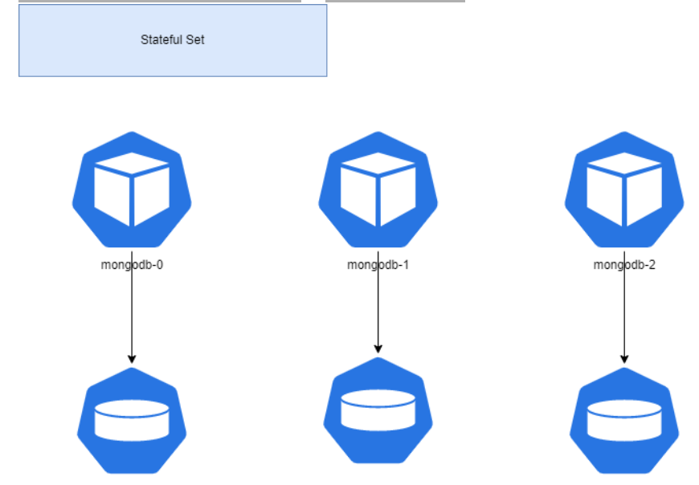
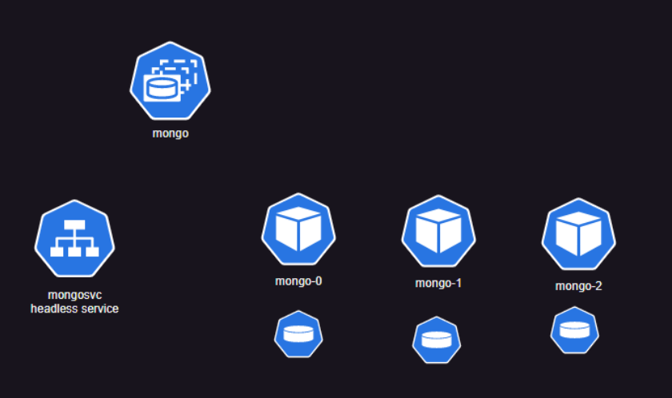

# Statefulsets


* Statefulset is like  deployment with replicas. But each pod gets its own volume.
* statefulsets is the best way to run any applications that needs some kind of volumes.

* Stateful Set is for stateful  applications

*  When we create replicas in Stateful Set we get predictable names
*  We can access individual pod, by creating headless service and by using ...svc.cluster.local 
*   Lets experiment with stateful sets and create nginx pods 
*   

* Using StatefulSets

* StatefulSets are valuable for applications that require one or more of the following.

    * Stable, unique network identifiers.
    * Stable, persistent storage.
    * Ordered, graceful deployment and scaling.
    * Ordered, automated rolling updates.


* refer: https://kubernetes.io/docs/concepts/workloads/controllers/statefulset/ 

* Lets create a statefulset and a headless service



* for the manifests

```

```

* for mount to the contianer

```

```

* Lets create an mongo db statefulset 


# Config Maps

* refer: https://kubernetes.io/docs/concepts/configuration/configmap/

* Config maps can be used in two ways 
     * environmental variables
     * mount paths

# Secrets

* Refer Here: https://kubernetes.io/docs/concepts/configuration/secret/

* for manifest:

```

```