# Pod Scheduling

* Pod affinity and antiaffinity

* In this example we had tried to place a pod B

* create a podb 
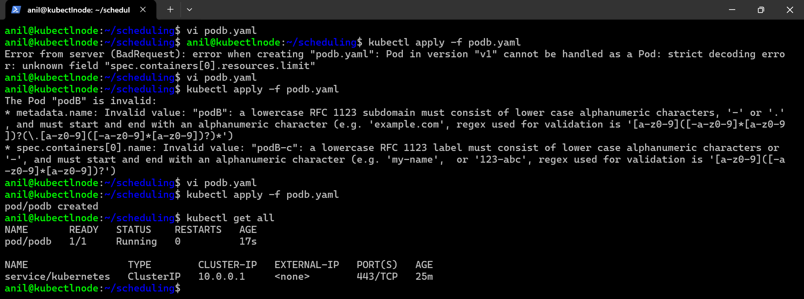
```
---
apiVersion: v1 
kind: Pod 
metadata: 
  name: podB
  labels:
    name: podB
spec:
  containers:
    - name: podB-c
      image: nginx
      ports:
        - containerPort: 80
      resources:
        limits:
          memory: "128Mi"
          cpu: "500m"

```

* We want to run the affinity pod on the same node as pod B same node = topology. 
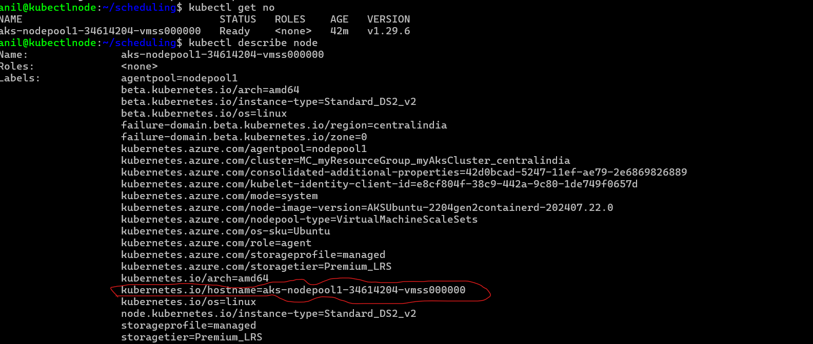
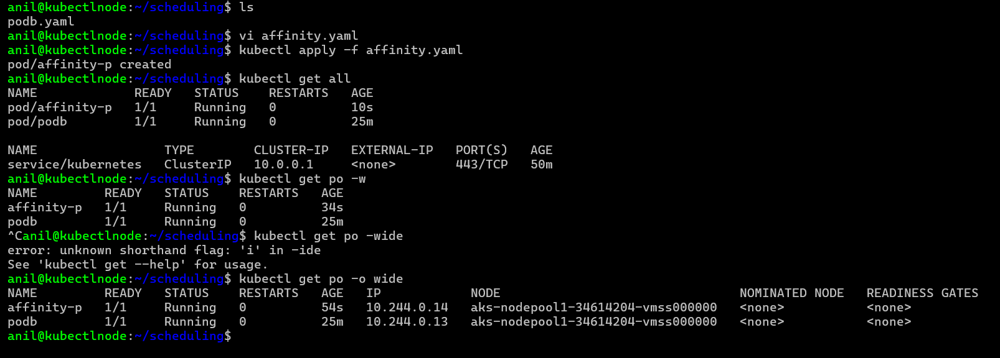

```
---
apiVersion: v1 
kind: Pod
metadata:
  name: affinity-p
  labels:
    name: affinity-p
spec:
  affinity: 
    podAffinity:
      requiredDuringSchedulingIgnoredDuringExecution: 
        - labelSelector:
            matchLabels:
              name: podb
          topologyKey: kubernetes.io/hostname
  containers:
    - name: affinity-c
      image: nginx
      resources: 
        limits:
          memory: "500Mi"
          cpu: "500m"
      ports:
        - containerPort: 80

```

* Topology for node is host name and we want to run antiaffinity pod on the different node

* apply the manifests

```
---
apiVersion: v1 
kind: Pod 
metadata:
  name: antiaffinity-p
  labels:
    name: antiaffinity-p
spec:
  affinity: 
    podAntiAffinity: 
      requiredDuringSchedulingIgnoredDuringExecution:
        - labelSelector:
            matchLabels:
              name: podb
          topologyKey: kubernetes.io/hostname
  containers:
    - name: antiaffinity-c
      image: nginx
      resources:
        limits:
          memory: "500Mi"
          cpu: "500m"
      ports:
        - containerPort: 80

```
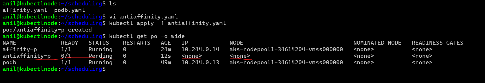

* in above pic antiaffity is pending because of i have only 1 node and not give the permission to schedule the pod on that node which i have .  

# node affinity

* refer: https://kubernetes.io/docs/tasks/configure-pod-container/assign-pods-nodes-using-node-affinity/

* __differences between nodeselector and node affinity__ 
* refer: https://kubernetes.io/docs/concepts/scheduling-eviction/assign-pod-node/#node-affinity

# Taint and toleration

```
Taints and tolerations are mechanisms in Kubernetes that work together to ensure that pods are not scheduled onto inappropriate nodes. They are used to control pod placement and manage workloads by specifying which nodes are suitable or unsuitable for certain pods.
```

# Taints 

```
A taint is applied to a node, marking it as having special properties that may affect which pods can be scheduled onto it. When a node is tainted, Kubernetes will avoid scheduling pods that do not tolerate the taint.


Taints have three components:

Key: Identifies the taint.
Value: Provides additional information about the taint.
Effect: Specifies the action to be taken by the scheduler when it encounters a node with a taint that is not tolerated by a pod.

```
# Tolerations

```
Tolerations are applied to pods and allow them to be scheduled onto nodes with matching taints. A toleration specifies that a pod can tolerate a specific taint, thereby allowing the pod to be scheduled on a node that has that taint
```

# summary 
```
Taints and tolerations are powerful tools for managing workload placement in Kubernetes, allowing you to have fine-grained control over where pods can be scheduled and ensuring that certain nodes are reserved for specific types of workloads.
```

* generally pod is selecting node but in Taint node is selecting pods / node to select pod. 
* refer: https://kubernetes.io/docs/concepts/scheduling-eviction/taint-and-toleration/ 

* Lets apply a taint for node1
`kubectl taint nodes aks-nodepool1-19501529-vmss000000 team=devops:NoSchedule`

* Lets create two pods one with toleration and other without toleration

* You add a taint to a node using kubectl taint. For example,
* `kubectl taint nodes node1 key1=value1:NoSchedule`
* for example: kubectl taint nodes aks-nodepool1-34614204-vmss000000 key1=value1:NoSchedule

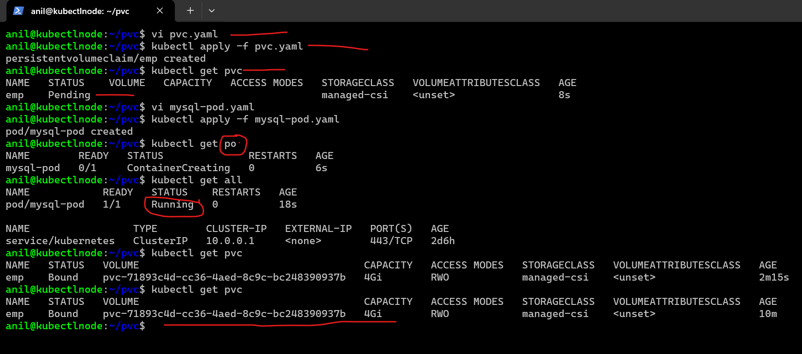

* in above pic notoleration is pending because it doesn't schedule on other node due to no other/ 2nd node is there.


* __if i bassically try to create a pod noschedual basically means that whatever is runnning before apply taints run it. but after applying taints you write `key:value=noschedule ` what should means it  now onwards any pod which has toleration `key:value=noschedule ` only will be executed here but whatevere is running in this machine before applying the taints will run as it is and it is not going to remove. But if i apply noExecute then that 2 pod will be moved to someother node first, that node is try that it only match those toleration__

* __ex: before apply taints if already pod is running on it so .__   
 
# notoleration

```
---
apiVersion: v1
kind: Pod 
metadata:
  name: notoleration
  labels:
    name: notoleration
spec:
  containers:
    - name: notoleration-c
      image: nginx
      resources:
        limits:
          memory: "128Mi"
          cpu: "500m"
      ports:
        - containerPort: 80
```
# toleration

```
---
apiVersion: v1 
kind: Pod 
metadata:
  name: toleration
  labels:
    name: toleration
spec:
  tolerations:
    - key: team 
      operator: Equal
      value: devops 
      effect: NoSchedule
  containers:
    - name: toleration-c
      image: nginx
      resources:
        limits:
          memory: "128Mi"
          cpu: "500m"
      ports:
        - containerPort: 80

```

------------------------------------------------------------------------------------------------------------
* # Note: We can try Priority class to assign pods a priority

------------------------------------------------------------------------------------------------------------


* # Persistent Volumes in Kubernetes (csi= container storage interface)
____________________________________________________________________________________________________________

* `Persistent Volumes (PVs): PVs are volume plugins like Volumes, but have a lifecycle independent of any individual Pod that uses the PV. They capture the details of the implementation of the storage, such as NFS, iSCSI, or cloud-provider-specific storage systems.`

* `Persistent Volume Claims (PVCs): PVCs are requests for storage by users. They define the specifications for the storage, including capacity, access mode, and storage class.`

* Kuberenetes implements Storage as CSI. There are lots of vendors who provide CSI implementations 
* Refer Here: https://kubernetes-csi.github.io/docs/drivers.html

* The interaction with storage is done by CSI

* k8s interacts with CSI to deal with storage

* This option enables dynamic provisioning also

* * k8s is not creating storage its asking to csi to create storage . 

* In managed k8s we have storage classes

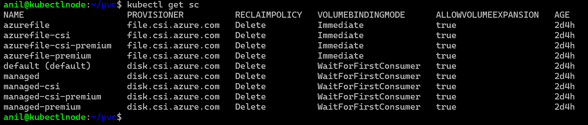

* We can initiate a request from pod for a PersistentVolume (PV) which is referred as Persistent Volume Claim (PVC)


* Lets create pvc and apply

```
---
apiVersion: v1
kind: PersistentVolumeClaim
metadata:
  name: emp 
spec:
  resources:
    requests:
      storage: 4Gi
  storageClassName: managed-csi 
  accessModes: 
    - ReadWriteOnce

```


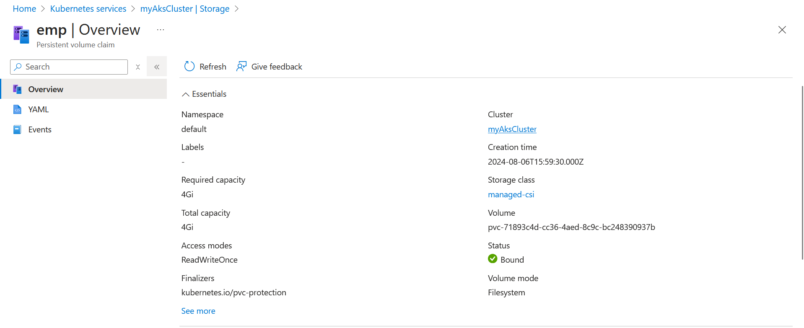

* Lets apply the pod with pvc

*  Lets create a mysql pod with a Persistent volume
*  How To Create a MySQL Database, Tables and Insert Data

```
---
apiVersion: v1
kind: Pod
metadata:
  name: mysql-pod
  labels:
    app: db
spec:
  containers:
    - name: mysql-c
      image: mysql:8.0-debian
      ports:
        - containerPort: 3306
      resources:
        limits:
          memory: "1024Mi"
          cpu: "1000m"
      env:
        - name: MYSQL_ROOT_PASSWORD
          value: anil@1234
        - name: MYSQL_DATABASE
          value: employees
        - name: MYSQL_USER
          value: anil
        - name: MYSQL_PASSWORD
          value: anil@1234
      volumeMounts:
        - name: my-vol
          mountPath: /var/lib/mysql 
  volumes: 
    - name: my-vol
      persistentVolumeClaim:
        claimName: emp 
        readOnly: false

```
```
       vi pvc.yaml
  162  kubectl apply -f pvc.yaml
  163  kubectl get pvc
  164  vi mysql-pod.yaml
  165  kubectl apply -f mysql-pod.yaml
  166  kubectl get po
  167  kubectl get all
  168  kubectl get pvc
  169  kubectl get po
  170  kubectl get po -0 wide
  171  kubectl get po -o wide

```
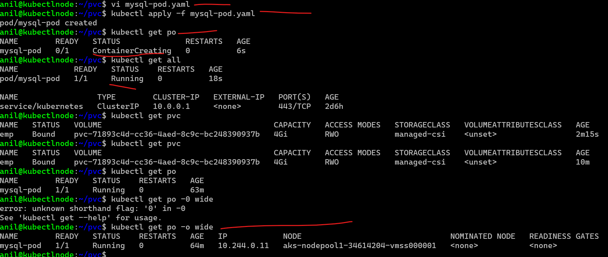

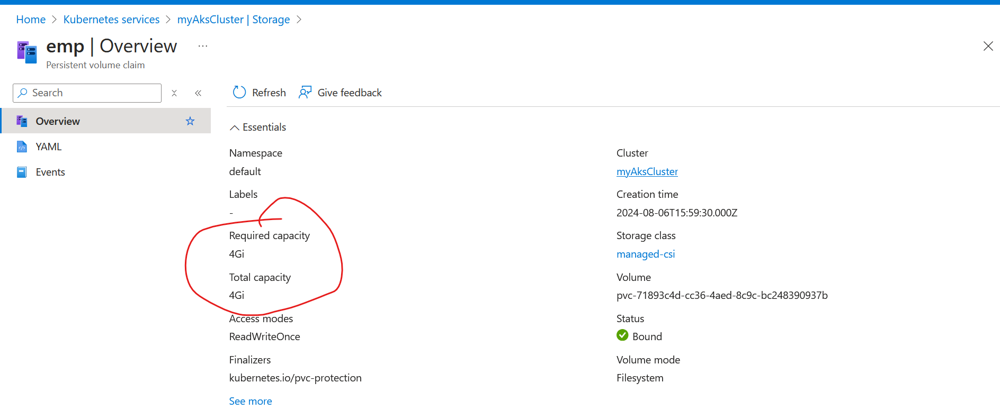

* Connect to database and insert some records

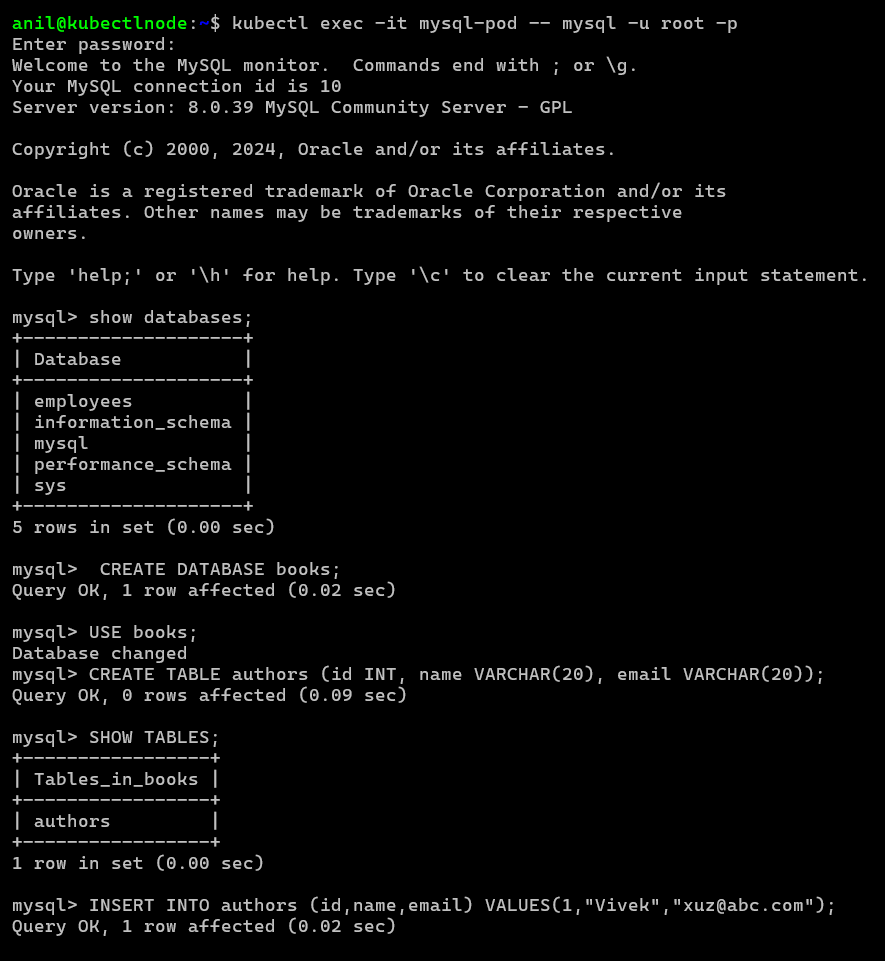

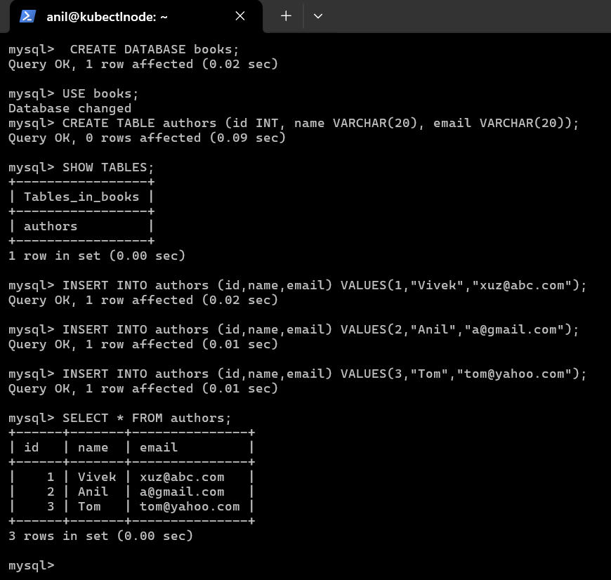


* Now lets delete the pod and recreate the pod by applying the manifest

```
kubectl exec -it mysql-pod -- mysql -u anil -p
kubectl exec -it mysql-pod -- mysql -u root -p
```


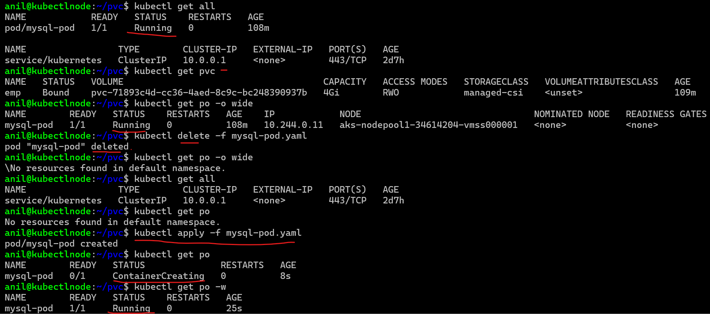 

 

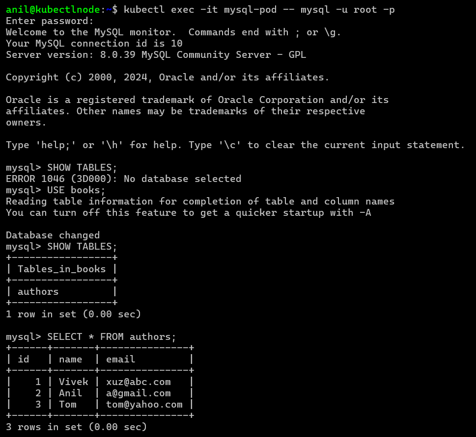 

* To statically provision volume 
* Refer Here: https://learn.microsoft.com/en-us/azure/aks/azure-csi-disk-storage-provision#static-provisioning-parameters

* for reclaim policy: 
* refer: https://kubernetes.io/docs/tasks/administer-cluster/change-pv-reclaim-policy/#:~:text=PersistentVolumes%20can%20have%20various%20reclaim,user%20deletes%20the%20corresponding%20PersistentVolumeClaim.

```
search on google
priority class 
removing low class 
```

* when you basically create csi there is something cames into play that is storage class . 
* storage class is  what are types of disk you want to create. 
* k8s has a extra implimentation or has flexibity  to dell with any types you of disk you want to create because of csi and any vendor, or there are many vendors who are selling storage will try to deal or will try to gives you csi driver all you need to do that install in k8s cluster, once you install it in your k8s cluster it will understand external storages also .
* seince it has given plugin option now we can use many external devices in k8s for this we need to write csi implimentation to that way of installing them.

# SMB : 

```
SMB (Server Message Block) in Kubernetes is a way to use network file shares with your Kubernetes pods. Here's a simple explanation:

What is SMB in Kubernetes?
SMB (Server Message Block): It's a network file sharing protocol that allows applications and users to access files on remote servers as if they were on their local computer.
Kubernetes: It's a system for managing containerized applications across multiple hosts.
Using SMB in Kubernetes:
Persistent Volume (PV): This is a piece of storage in the Kubernetes cluster. It can use SMB to connect to a remote file share.
Persistent Volume Claim (PVC): This is a request for storage by a Kubernetes pod. It claims a piece of the Persistent Volume.
Secrets: These are used to store sensitive data like SMB credentials (username and password) securely.
Steps to Use SMB in Kubernetes:
Create a Secret: Store your SMB credentials in a Kubernetes secret.
Define a Persistent Volume (PV): Specify the details of the SMB share in a PV YAML file.
Create a Persistent Volume Claim (PVC): Define how much storage you need and create a PVC YAML file.
Mount the PVC in a Pod: Use the PVC in your pod definition so the pod can access the SMB share.
Why Use SMB in Kubernetes?
Network Storage: It allows Kubernetes pods to access files on a network share.
Shared Storage: Multiple pods can read and write to the same storage.
Flexibility: You can use existing SMB shares without changing your infrastructure.
In essence, SMB in Kubernetes lets your containerized applications use network file shares seamlessly.

```


what are the type of storage which you want to deal with 
persistance volume it is a actuall volume 
persistance volume claim is request that is making like i want to 5gb or i need a 5gb disk that request that pod is making something is called as pvc.
volume is all about disk not about database.

# if you k8s cluster wants to speak with rds so it is a networking issuse not storage issues beacues you need to figure out how your pod is communicate with existing database.

#       summary 

# a service without an / no ip called as headless service

* genrally whenever we use statefulsets we will use headless service so what is headless service? it is a service without an ip address . why we use that service without an ip address open with a chance for me to go to a pod specific by giving `pod name.service name` 
* generally you have to try by give name namespace name after that `service.default test or qa` 
* so generally any company how wants to run databases inside the k8s cluster not outside prefeard statefulsets. Even though they have 1 replicas they will put in statefulsets because its takes away  a lot of administrative efforts because if that pod is going down it automaticall attached with same persistent volume.

# StatefulSets and Deployments

* In Kubernetes, both StatefulSets and Deployments are used to manage the lifecycle of applications, but they serve different purposes and are suitable for different types of applications. Here’s a detailed comparison of StatefulSets and Deployments: 

# Deployments

```
Use Case:

Ideal for stateless applications.
Suitable for applications that can be replicated and do not require persistent storage or unique network identifiers.

* Replicas Management:

Ensures a specified number of pod replicas are running.
Handles scaling up and down.

* Rolling Updates:

Supports rolling updates with zero downtime.
Automatically rolls back to the previous version if the update fails.

* Stateless Pods:

Pods are interchangeable and do not retain state.
Any pod can handle any request.

* Replica Identifiers:

Pods are assigned random names.
No guarantee of stable network identity.

```
* Deployments manifest file

```
apiVersion: apps/v1
kind: Deployment
metadata:
  name: my-deployment
spec:
  replicas: 3
  selector:
    matchLabels:
      app: my-app
  template:
    metadata:
      labels:
        app: my-app
    spec:
      containers:
      - name: my-container
        image: nginx
        ports:
        - containerPort: 80

```

# StatefulSets

* __Use Case:__

* Ideal for stateful applications.
* Suitable for applications that require stable network identities, ordered deployment, and persistent storage.

* __Stable Network Identity:__

* Each pod gets a unique, stable network identifier.
* Useful for databases or clustered applications where each instance needs a unique address.

* __Ordered Deployment and Scaling:__

* Pods are created in order (0, 1, 2, ...).
* Ensures that the deployment, scaling, and termination happen in a controlled, sequential manner.

* __Persistent Storage:__

* Pods are associated with persistent storage volumes.
* Even if a pod is deleted, the data in its volume remains intact and can be reattached to a new pod with the same identity.

* __Unique Pod Names:__

* Pods have predictable names based on the StatefulSet name and ordinal index (e.g., my-app-0, my-app-1).

* __Example__

```
apiVersion: apps/v1
kind: StatefulSet
metadata:
  name: my-statefulset
spec:
  serviceName: "my-service"
  replicas: 3
  selector:
    matchLabels:
      app: my-app
  template:
    metadata:
      labels:
        app: my-app
    spec:
      containers:
      - name: my-container
        image: my-image
        ports:
        - containerPort: 80
        volumeMounts:
        - name: my-storage
          mountPath: /data
  volumeClaimTemplates:
  - metadata:
      name: my-storage
    spec:
      accessModes: [ "ReadWriteOnce" ]
      resources:
        requests:
          storage: 1Gi

```

# Summary of Deployments and Statefulsets

* __Deployment:__ Best for stateless applications that need to be scalable and require rolling updates with zero downtime. It does not guarantee stable network identity or persistent storage.

* __StatefulSet:__ Best for stateful applications that require stable network identity, ordered deployment, and persistent storage. It is essential for applications like databases, where each instance needs to maintain its state and identity.

```
* Stateless Applications:

Do not retain state between requests.
Easily scalable and replaceable.
Suitable for frontend applications, web servers, and microservices.

* Stateful Applications:

Retain state across requests.
Require persistent storage and stable network identities.
Suitable for databases, message queues, and other applications where data persistence and consistency are crucial.

__The choice between stateless and stateful depends on the nature of the application and its requirements for data persistence and session management. Stateless applications benefit from simplicity and ease of scaling, while stateful applications provide the necessary structure for handling data and state consistently.__

```

# 