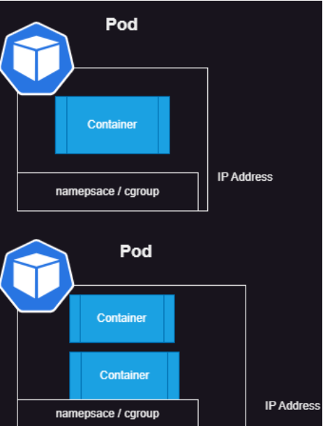

* for kubectl cheatsheet: https://kubernetes.io/docs/reference/kubectl/quick-reference/
# Kubernetes kubeadm setup
* workflow

* Kubectl: kubernetes commandline tool
* kubectl is a commandline tool to communicate with k8s cluster.
* kubectl tools needs a configuration file (kubeconfig),general location of configuration is             `~/.kube/config`

* Setup auto-completion refer here: https://kubernetes.io/docs/reference/kubectl/quick-reference/#kubectl-autocomplete


# Atomic unit of k8s = Pod

* Pod Lifecycle 
   * K8s Pods will have following states
        * Pending
        * Running 
        * Succeded
        * Failed 
        * Unknown

# Container States in k8s pod

   * Waiting
   * Running 
   * Terminated 
   * for container states : https://kubernetes.io/docs/concepts/workloads/pods/pod-lifecycle/#container-states
   * IN pods we can specify container restart policy : https://kubernetes.io/docs/concepts/workloads/pods/pod-lifecycle/#restart-policy
     
* k8s creates pods and container runs in the Pod
* Pod can have 1 or more containers
* Each Pods in k8s gets a unique ipaddress
* For multi container pods, the communication between containers in the same pod will be on localhost (127.0.0.1) 



* To run any application in k8s we have to create a pod

# k8s ways of working

* For k8s everything is object. The objects are exposed over api.
  we can find out all the resources we can create in a cluster by executing a simple command . 

```
kubectl api-resources
```


* Since functionality is exposed over api, we have different client libraries to interact with k8s programatically refer:https://kubernetes.io/docs/reference/using-api/client-libraries/
* refer:https://kubernetes.io/docs/reference/generated/kubernetes-api/v1.30/#container-v1-core

* kubectl hint: we can get the information of any object

``` 
kubectl get <resource-type>
kubectl get <resource-type> -o wide 
```


* to understand what are options in a resource

`kubectl explain <resource-type>`


* To view a particular object
* `kubectl describe <resource-type> <resource-name>`
  

