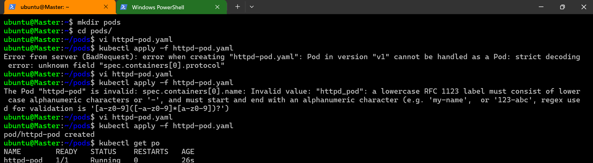
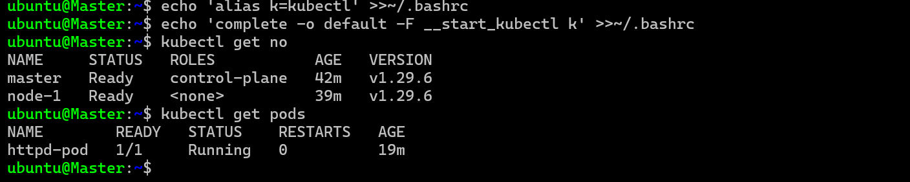
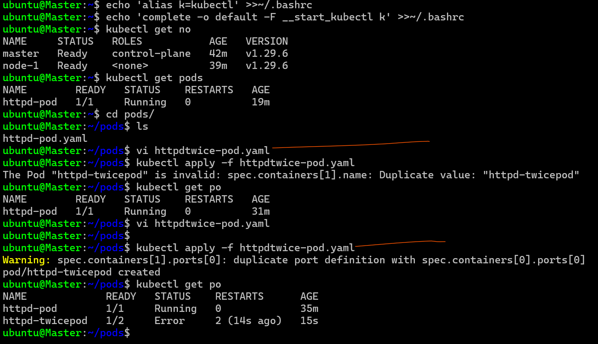

## YAML 
* for YAML and Json tutorial refer:https://www.youtube.com/watch?v=ggOmHlnhPaM&list=PLuVH8Jaq3mLud3sVDvJ-gJ__0zd15wGDd

# Writing k8s manifests

* when we write manifest we intrect with api server using kubectl 
* kube api server exposes k8s resources as REST API's 
* K8s api versioning: https://kubernetes.io/docs/reference/using-api/#:~:text=The%20named%20groups%20are%20at,groups%20in%20Kubernetes%20API%20reference.
     * apigroup: this is grouping by k8s  for versioning 
     * version:
* every k8s resource which we create we need to write apiVersion 

```
# rule
apiVersion: <group:version>

# if the group is core 
apiVersion: <version>
```
* api reference: https://kubernetes.io/docs/reference/
* 1.29 api reference : https://kubernetes.io/docs/reference/generated/kubernetes-api/v1.29/

# Activity 1: lets create an httpd pod manifest 

* Docker image information 
     * image: `httpd:2.4`
     * port:80

* Lets write manifest: 
```
---
apiVersion:	v1
kind: Pod
metadata:
  name: httpd-pod
spec:
  containers:
    - name: httpd_pod
      image: httpd:2.4
      ports:
        - containerPort: 80 
          protocol: "TCP" 

```



# Activity 2: Create a pod with 2 containers

* create a pod with 2 httpd containers 
```
---
#httpd twice pod
apiVersion: v1
kind: Pod
metadata:
  name: httpd-twicepod
spec:
  containers:
    - name: httpd-twicepod1
      image: httpd:2.4
      ports: 
        - containerPort: 80 
          protocol: "TCP"
    - name: httpd-twicepod2
      image: httpd:2.4
      ports: 
        - containerPort: 80 
          protocol: "TCP" 
```
* 2 containers in the pod should not be using the same port

