# Running pods in kubernetes                                       `26`

* run an alpine container in docker 
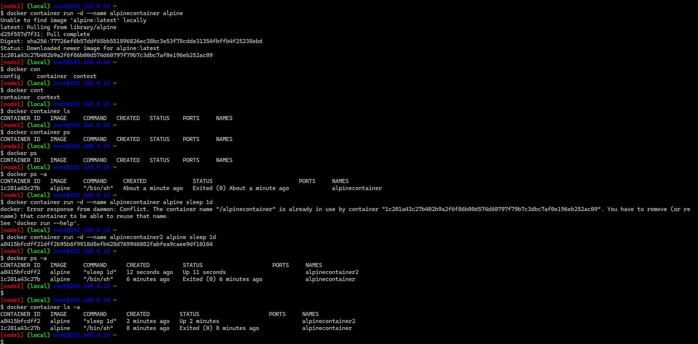

# trail1
* Run an alpine container in a pod which goes into exited state immedietly 

```
---
# alpine container in a pod, it will die coz cmd not given 

apiVersion: v1
kind: Pod
metadata:
  name: trail1 
spec:
  containers:
    - name: dyingalpine1
      image: alpine
```
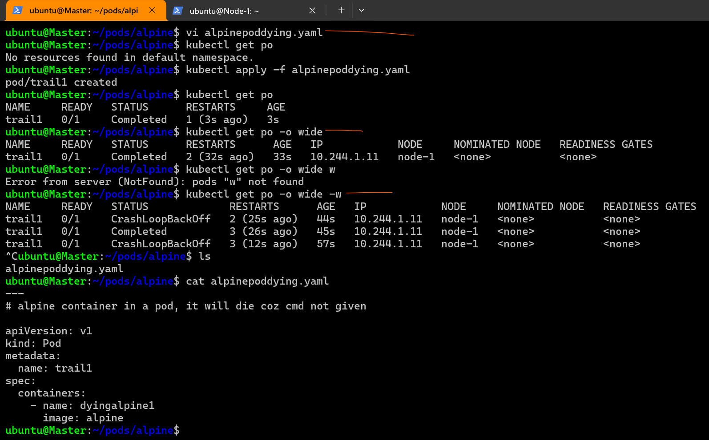

* as we know the container will endup in exited state. k8s is trying to restart the container to maintained the desired state.
* it keeps restarting and if the container does not start , it sets the state to __CrashloopBackoff__ and keeps restarting. 

# Trail2

* Run an alpine container with sleep 1d as CMD 
```
---
# alpine container in pod with sleep 1d

apiVersion: v1
kind: Pod
metadata:
  name: trail2
spec:
  containers:
    - name: alpine1d
      image: alpine
      args:
        - sleep
        - 1d

```
* Lets apply the manifest 
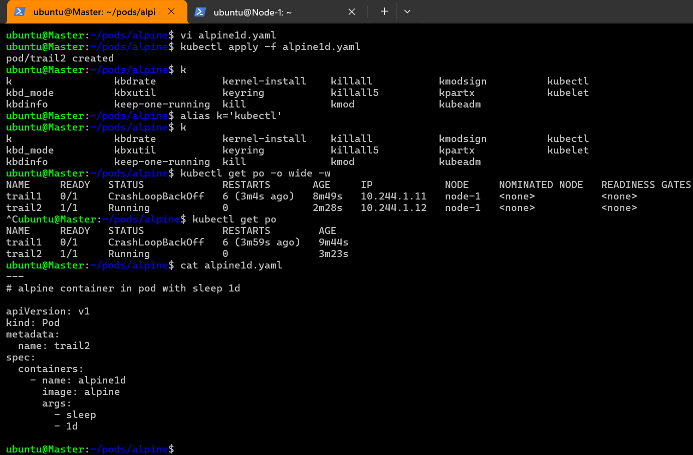

* if we want execute any command in the container
* __Docker__ `docker container exec`
* __K8s__ `kubectl exec <pod> -- <cmd>`

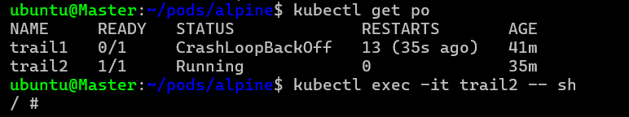 
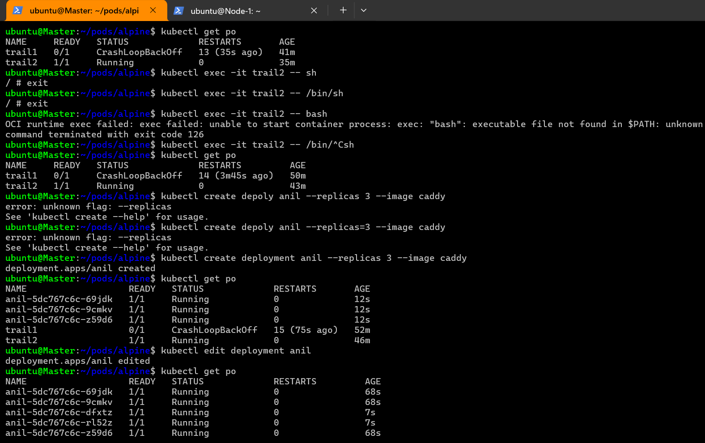
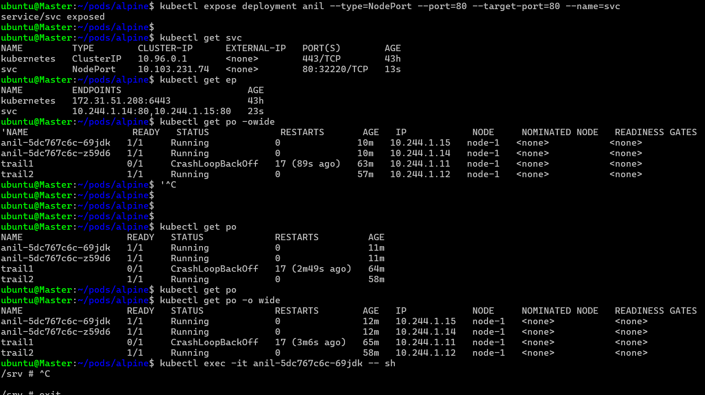
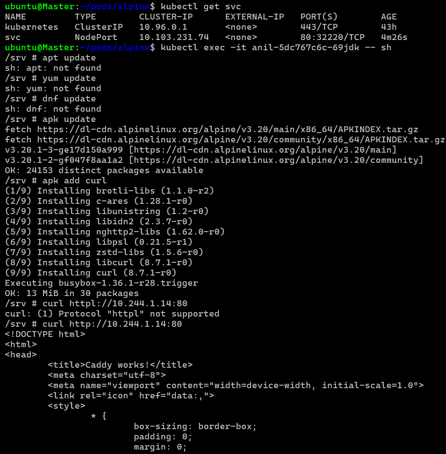
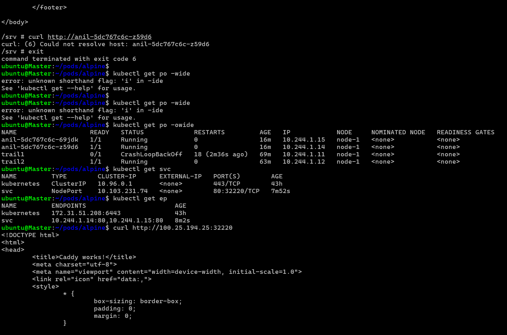


* Exercise: findout a way to login into specific container in a pod
`kubectl exec -it mypod-xyz123 -c <container-name> -- /bin/sh or sh`

* Describe the Pod:
`kubectl describe pod mypod-xyz123`

# Trail 3

* __docker__ 
* Run an mysql contianer and pass environmental variables to set username, root password, password, database
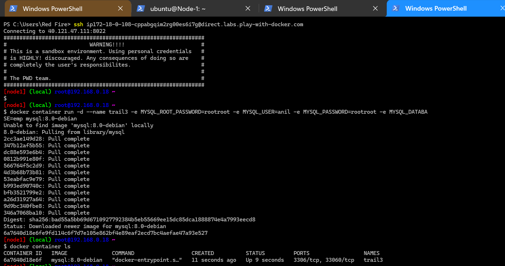
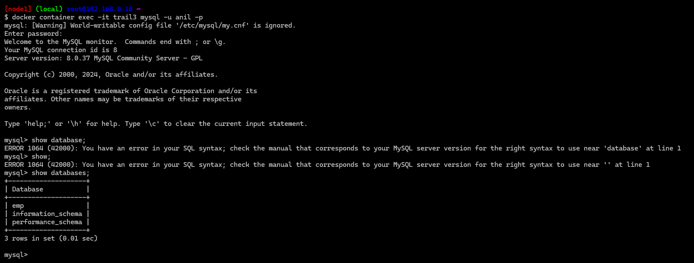
* docker command
`docker container run -d --name trail3 -e MYSQL_ROOT_PASSWORD=rootroot -e MYSQL_USER=anil -e MYSQL_PASSWORD=rootroot -e MYSQL_DATABA
SE=emp mysql:8.0-debian`

* the k8s manifest
```
---
#creating container of mysql in a pod

apiVersion: v1
kind: Pod
metadata:
  name: trail3
spec:
  containers:
    - image: mysql:8.0-debian
      name: mysql 
      env:
        - name: MYSQL_ROOT_PASSWORD
          value: rootroot
        - name: MYSQL_USER
          value: anil
        - name: MYSQL_DATABASE
          value: emp  
        - name: MYSQL_PASSWORD
          value: rootroot 

```
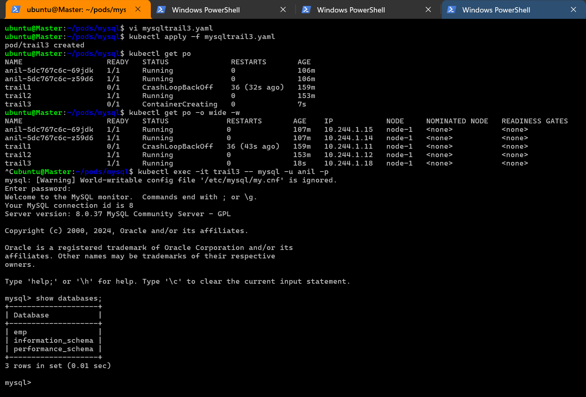

* Exercise: try creating any other database pod (postgres, sqlserver on linux, oracle)

# Trail 4

* Figure out a __docker__ command to create jenkins container with 
      * 1 vcpu
      * 512 mb of RAM
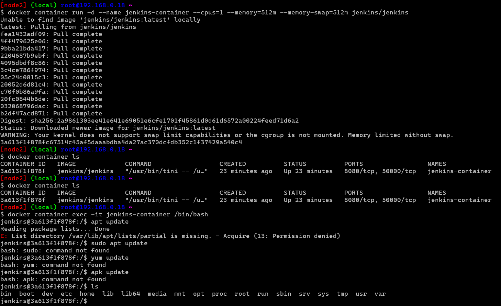

* Also using docker stats view what has been attached to container
* Google: soft limit hard limit

* Concepts: Resource Management refer:https://kubernetes.io/docs/concepts/configuration/manage-resources-containers/
       
       * Requests
       = requests: that is minimum amount of resources given to your containers  (lower bound )  
       * limits   
       = limits:  the maximum extend (upper bound)
       * 1000m means 1 cpu
       * 500m means half cpu
       * if you want 2 cpus so type either 2 or 2000m
* ` vi jenkins-pod.yaml` then `kubectl apply -f jenkins-pod.yaml`
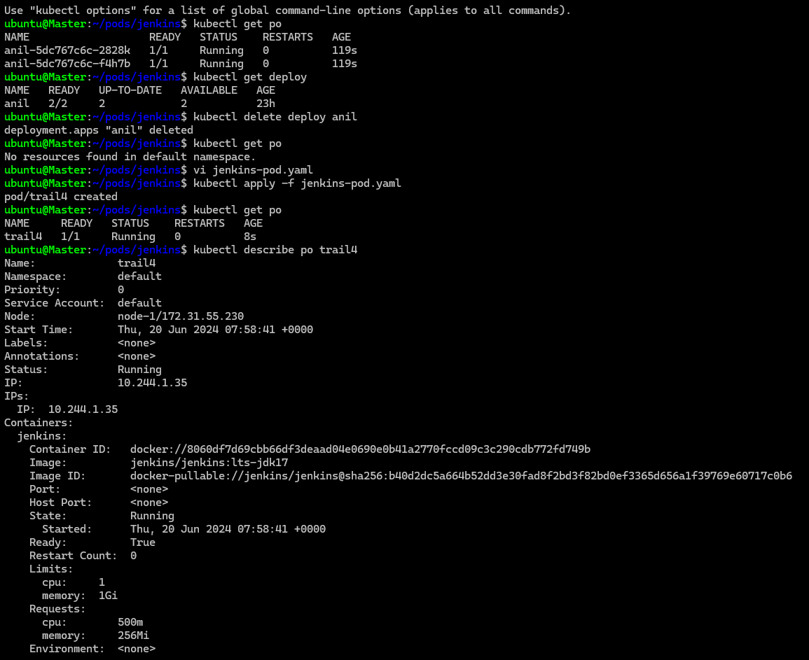
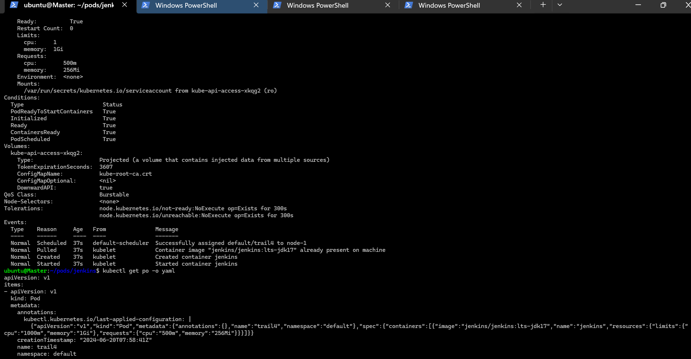

* Resource Units
* CPU: Measured in cores.
* 1 CPU = 1 core. 500m (millicores) = 0.5 cores.
* Memory: Measured in bytes.
* Mi (Mebibytes) = 2^20 bytes = 1,048,576 bytes.
* Gi (Gibibytes) = 2^30 bytes = 1,073,741,824 bytes.

# Units of Measurement

# CPU:

```
Measured in cores.
1 CPU = 1 core.
1000m (millicores) = 1 core.
250m = 0.25 cores.
```
# Memory:

```
Measured in bytes.
Mi (Mebibytes) = 2^20 bytes = 1,048,576 bytes.
Gi (Gibibytes) = 2^30 bytes = 1,073,741,824 bytes.
64Mi = 64 * 1,048,576 bytes = 67,108,864 bytes.
```

```
Summary
Resource Requests: Guaranteed resources for the container.
Resource Limits: Maximum resources a container can use.
CPU and Memory Units: Measured in cores and bytes (MiB/GiB).
Best Practices: Set appropriate requests/limits, monitor usage, and use quotas and limits to manage resources effectively.
```
# Breaking Down the Specification

* Memory Request: 64Mi
```
Meaning: The container is guaranteed 64 Mebibytes of memory.
Implication: The Kubernetes scheduler will ensure that the node where this pod is scheduled has at least 64Mi of available memory.
Calculation: 64 MiB = 64 * 1,048,576 bytes = 67,108,864 bytes.
```

# CPU Request: 250m

```
Meaning: The container is guaranteed 250 millicores of CPU.
Implication: The Kubernetes scheduler will ensure that the node where this pod is scheduled has at least 250 millicores of available CPU.
Calculation: 250 millicores = 0.25 cores.
```
# Memory Limit: 128Mi
```
Meaning: The container can use up to 128 Mebibytes of memory.
Implication: If the container tries to use more than 128Mi of memory, it will be terminated (OOMKilled).
Calculation: 128 MiB = 128 * 1,048,576 bytes = 134,217,728 bytes.
```

# CPU Limit: 500m

```
Meaning: The container can use up to 500 millicores of CPU.
Implication: If the container tries to use more than 500 millicores of CPU, it will be throttled.
Calculation: 500 millicores = 0.5 cores.
```