# Kubernetes Pod(s) 

# Q; i am using my desktop in my desktop i have kubectl  but in my company there are 5 k8s clusters how can use same kubectl for multiple clusters
__ans: go in kubectl context section__


# Pod

* https://kubernetes.io/docs/concepts/workloads/pods/

* Pod is atomic or smallest unit of creation in K8s
* Each Pod gets an unique ip address
* Each Pod has one or more containers in it.
* All the containers in the POd share same namespaces.
* K8s scaling means scaling Pods but not containers in it.
* Easiest way to create a pod
   * `kubectl run <name> --image <image>`
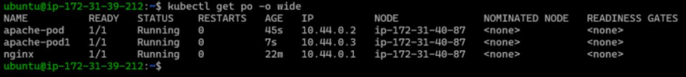

# Primary Workload of K8s = Pod

* Pod is an atomic unit of k8s which contains Containers
* Pod will have containers
* In k8s every resource which we create needs a name

Pods will have 4 types of containers in it
------------------------------------------

* containers: These are main containers where the applications run

sidecar container:
------------------
  * These are contianers which add additional functionality such as agents (log, monitoring etc) to the application Refer Here: https://kubernetes.io/blog/2023/08/25/native-sidecar-containers/#what-are-sidecar-containers-in-1-28

init-container: 
--------------- 
  * Init containers in Kubernetes (k8s) are specialized containers that run before the main application containers within a pod start7. They perform initialization tasks, setting up prerequisites, configuring dependencies, or preparing the environment for the main containers

  * These containers are created in a sequential order before the main containers. These containers are used to do configuration. init containers are supposed to be running for a finite time. Main containers are created after init containers have finished executing

ephmeral containers: 
---------------------
  * they are present for debugging purposes & are not part of Pod lifecycle, we inject this container with kubectl debug command

```yaml


```
# Kubernetes Pod Lifecycle

* refer: https://kubernetes.io/docs/concepts/workloads/pods/pod-lifecycle/

* For Kubernetes Pod the desired state is to ensure the containers in Pod are in running state. For any reason if the contianer gets into exited state, Pod will retry restarts continuously. This state is referred as `CrashLoopBackOff`

# Writing Pod Manifests

* Most of the k8s manifests have 4 sections (apiVersion, kind, metadata, spec) which will represent resource and desired state and there will a 5 section (status) which represents status (generated)

* Navigate to Apireference
    * https://kubernetes.io/docs/reference/
    * 1.32[https://kubernetes.io/docs/reference/generated/kubernetes-api/v1.32/]
    * 1.31

* Lets create an nginx pod i.e. pod with nginx container in it
 
* Now lets look at some useful kubectl commands
# Watch
kubectl get pods -w
# get more info
kubectl get pods -o wide
# describe resource
kubectl describe pod nginx-pod
# Get the the output in yaml format
kubectl get pod nginx-pod -o yaml

* I want to run the following containers give me docker commands

    * alpine container with runs for 1 day 
       * `docker run -d --name alptest alpine sleep 1d`
    * mysql with root password, user , password and database
       * `docker run -d --name mysqltest -e MYSQL_ROOT_PASSWORD=test123 mysql:9`

* Manifest for alpine
```yaml
---
apiVersion: v1
kind: Pod 
metadata:
  name: alpine-pod
spec:
  containers:
    - name: alpine-c 
      image: alpine:3.21
      args:
        - sleep
        - 1d
```

* Manifest for mysql

```yaml
---
apiVersion: v1 
kind: Pod 
metadata:
  name: mysql-pod
spec:
  containers:
    - name: mysql-c 
      image: mysql:9
      ports:
        - containerPort: 3306 
      env: 
        - name: MYSQL_USER
          value: anil 
        - name: MYSQL_PASSWORD
          value: rootroot
        - name: MYSQL_ROOT_PASSWORD
          value: rootroot
        - name: MYSQL_DATABASE
          value: anilapps
```

* Running commands in the container belonging to a Pod
* `kubectl exec <pod-name> -- <command>`
* `kubectl exec -it mysql-pod -- /bin/bash`

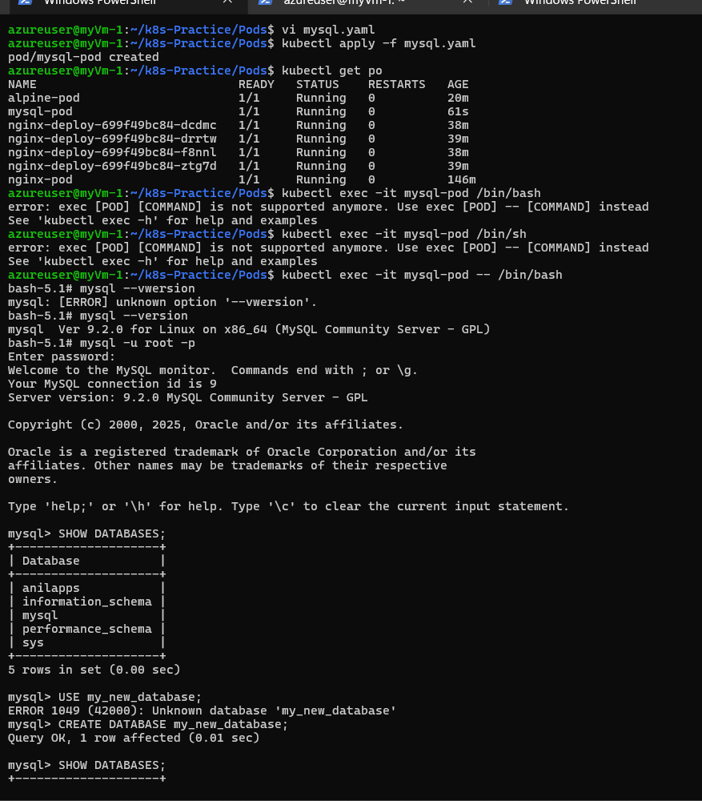

* Docker restricted resources and how to create 
    * Refer Here: https://directdevops.blog/2019/10/07/docker-logging-docker-memory-cpu-restrictions/

* __Pod Life cycle__ 
    * Pod-Phases : https://kubernetes-docsy-staging.netlify.app/docs/concepts/workloads/pods/pod-lifecycle/
        * A Pod's `status` field is a PodStatus object, which has a `phase` field. 
    
    * Container states in Pod : https://kubernetes.io/docs/concepts/workloads/pods/pod-lifecycle/#container-states

Resources in Pod
----------------

* refer: https://kubernetes.io/docs/concepts/configuration/manage-resources-containers/

* It is a recommended practice to define the range of resource needs in a pod spec for a container
* resources defines a boundary of needs with requests as lower limit and limits as higher limit
* IN resource we can specify
    * memory
    * cpu
    * hugepage size
    * gpu 
* requests (lower limit) impact scheduling decisions
* Best Practice:
    * Is to define both requests and limits
    * At a bare minimum atleast define limits
    * when CPU usage of a container is more than limits then it throttles and when the memory need of container is more than limits, outofmemory (oom) error will be thrown

QOS (Quality of Service)
------------------------
  * Guaranteed
      * same requests and limits
  
  * Burstable
      * minimum requests and maximum limits
  
  * Best Effort:
      * No resources are defined


* __Container restart policy__: https://kubernetes.io/docs/concepts/workloads/pods/pod-lifecycle/          #restart-policy
       * when a request for a pod creation arrives to api server its stored the details in `etcd` and inform the schedualer to schedule the pod on a node by identifiying suitable node and informs the kubelet. 
       * kubelet with the help of container runtime create a container in the pod. 
       * Each pod get an ip address with the help of cni plugin.
       * CNI plugin is responsible for low level networking to pod.
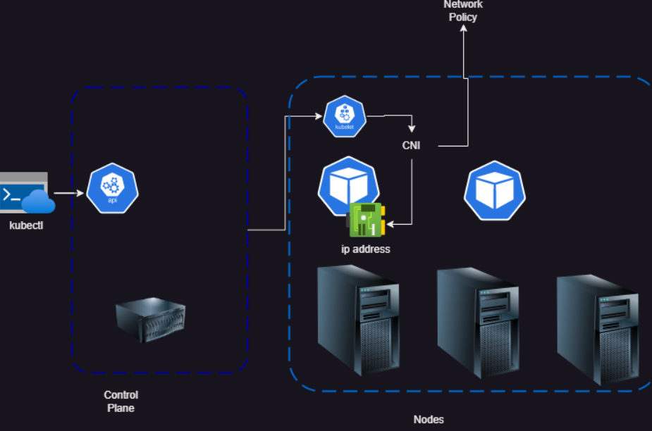  

__Choosing CNI Plugin__
------------------------------

* What does CNI do

    * Allocating IP address to Pods
    
    * Configuring virtual network interfaces in Pod and its routing table

    * Enforcing network policies (depends on CNI chooses)

    * Enables communication between pods

* Kubernetes does not come with default CNI, so after installing k8s we are supposed to install CNI plugin


| CNI Plugin            | Network Policy Support | Basic Features                                                                                                                                                                                                                                                                                                                                                        |
|-----------------------|------------------------|----------------------------------------------------------------------------------------------------------------------------------------------------------------------------------------------------------------------------------------------------------------------------------------------------------------------------------------------------------------------|
| Calico                | Yes                    | Designed for flexibility, high network performance, and advanced network administration; uses BGP routing as an underlay or IP-in-IP and VXLAN as an overlay; supports network policy management, access control lists (ACLs), and WireGuard for tunneling encryption[5].                                                                                              |
| Weave Net             | Yes                    | Creates a mesh overlay network connecting all cluster nodes; handles fault tolerance, load balancing, and name resolution via a Weave DNS server; uses IPsec for encryption and VXLAN for encapsulation and routing[5].                                                                                                                                                  |
| Cilium                | Yes                    | Can be used with multiple Kubernetes clusters and provides multi-CNI features; offers high-level inspection and pod-to-pod connectivity across clusters; manages packet inspection with network and application layer awareness; supports Kubernetes Network Policies through HTTP request filters[9].                                                                     |
| Azure CNI             | Yes                    | Extends Azure Virtual Networks to containers[3].                                                                                                                                                                                                                                                                                                                      |
| Multus CNI            | N/A                    | Allows pods to have multiple network interfaces[3].                                                                                                                                                                                                                                                                                                                    |
| OVN4NFV-K8S-Plugin    | N/A                    | An OVN based CNI controller plugin to provide cloud native based Service function chaining (SFC), Multiple OVN overlay networking[3].                                                                                                                                                                                                                                 |
| Kube-OVN              | Yes                    | Bases on OVN/OVS and provides advanced features like subnet, static IP, ACL, QoS, etc[3].                                                                                                                                                                                                                                                                             |
| Hybridnet             | N/A                    | Designed for hybrid clouds, providing both overlay and underlay networking for containers in one or more clusters; overlay and underlay containers can run on the same node with cluster-wide bidirectional network connectivity[3].                                                                                                                                     |
| Terway                | N/A                    | A collection of CNI Plugins based on Alibaba Cloud VPC/ECS network product[3].                                                                                                                                                                                                                                                                                        |
| DANM                  | N/A                    | A CNI-compliant networking solution for TelCo workloads running on Kubernetes[3].                                                                                                                                                                                                                                                                                      |
| Knitter               | N/A                    | A CNI plugin supporting multiple networking for Kubernetes[3].                                                                                                                                                                                                                                                                                                         |
| cni-route-override    | N/A                    | A meta CNI plugin that overrides route information[3].                                                                                                                                                                                                                                                                                                                 |
| Spiderpool            | N/A                    | An IP Address Management (IPAM) CNI plugin of Kubernetes for managing static IP for underlay network[3].                                                                                                                                                                                                                                                             |
| Bridge                | No                     | Creates a bridge and adds the host and the container to it[1].                                                                                                                                                                                                                                                                                                         |
| ipvlan                | No                     | Adds an ipvlan interface in the container[1].                                                                                                                                                                                                                                                                                                                         |
| loopback              | No                     | Sets the state of loopback interface to up[1].                                                                                                                                                                                                                                                                                                                        |
| macvlan               | No                     | Creates a new MAC address and forwards all traffic to that to the container[1].                                                                                                                                                                                                                                                                                          |
| ptp                   | No                     | Creates a veth pair[1].                                                                                                                                                                                                                                                                                                                                               |
| vlan                  | No                     | Allocates a VLAN device[1].                                                                                                                                                                                                                                                                                                                                          |
| host-device           | No                     | Moves an already-existing device into a container[1].                                                                                                                                                                                                                                                                                                                  |
| dummy                 | No                     | Creates a new Dummy device in the container[1].                                                                                                                                                                                                                                                                                                                      |
| win-bridge            | No                     | Creates a bridge and adds the host and the container to it (Windows specific)[1].                                                                                                                                                                                                                                                                                        |
| win-overlay           | No                     | Creates an overlay interface to the container (Windows specific)[1].                                                                                                                                                                                                                                                                                                     |
| dhcp                  | No                     | Runs a daemon on the host to make DHCP requests on behalf of the container[1].                                                                                                                                                                                                                                                                                          |
| host-local            | No                     | Maintains a local database of allocated IPs[1].                                                                                                                                                                                                                                                                                                                        |
| static                | No                     | Allocates a single static IPv4/IPv6 address to container, useful for debugging[1].                                                                                                                                                                                                                                                                                       |
| tuning                | No                     | Tweaks sysctl parameters of an existing interface[1].                                                                                                                                                                                                                                                                                                                  |
| portmap               | No                     | An iptables-based port mapping plugin; maps ports from the host’s address space to the container[1].                                                                                                                                                                                                                                                                       |
| bandwidth             | No                     | Allows bandwidth-limiting through use of traffic control tbf (ingress/egress)[1].                                                                                                                                                                                                                                                                                       |
| sbr                   | No                     | A plugin that configures source-based routing for an interface (from which it is chained)[1].                                                                                                                                                                                                                                                                          |
| firewall              | No                     | A firewall plugin that uses iptables or firewalld to add rules to allow traffic to/from the container[1].                                                                                                                                                                                                                                                                |

#

Which CNI to choose (on-premise)
-------------------------------------

* The size of k8s cluster
   * smaller cluster
   * larger cluster

* Observability
* Network policy
* latency


   * Calico:
       * Network policy: supported
       * Used for large clusters
   * Flannel
       * Network policy: unsupported
       * For dev, test environments,
   * Weavenet
       * Network policy: supported
       * Simple and seamless networking, suitable for small clusters
   * Cilium
       * Network policy: supported
       * using eBPF networking standard which implements the network observability. Generally used for large enterprise applications
   * AWS VPC-CNI:
       * This CNI implemented by AWS to create Pods in Elastic Kubernetes Service which are VPC functionality aware.
   * Azure CNI
       * This CNI implemented by Azure to create Pods in Azure Kubernetes Service which are VNet functionality aware.
    


* __Container types in Pod__
   * Inside pods we can create the following types of containers
       * init container
       * container: these are main contianer which run the application
       * ephemeralContainers
       * sidecarContainers
# Trail 5:

* Creates a k8s pod manifest with the following
   * init container: create a alpine container with sleep 30s 
   * container: run nginx or httpd 

```yaml
---
apiVersion: v1
kind: Pod 
metadata:
  name: trail5
spec:
  restartPolicy: OnFailure
  initContainers:
    - name: init1
      image: alpine
      args:
        - sleep
        - 30s 
  containers:
    - name: nginx
      image: nginx:1.27
      resources:
        requests:
          memory: 128 Mi
          cpu: 250m
        limits:
          memory: 0.5Gi
          cpu: 1000m

```
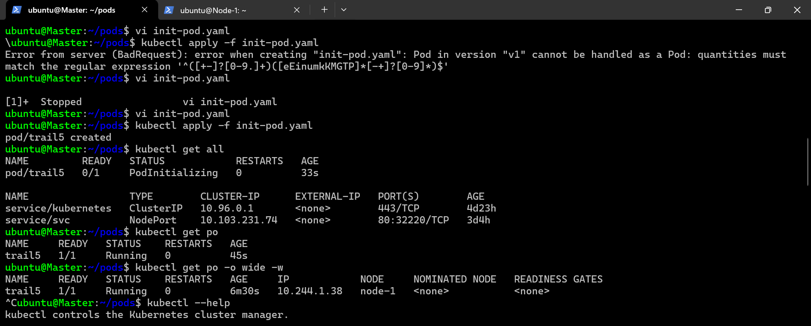
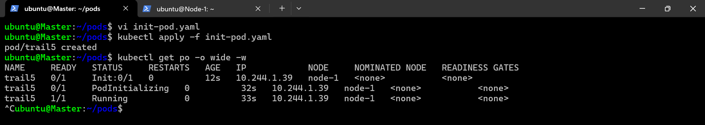

* Lets add two more init continers with sleep 10s and add one more container in containers

```yaml
---
apiVersion: v1
kind: Pod
metadata: 
  name: trail6
spec: 
  restartPolicy: OnFailure
  initContainers: 
    - name: init2
      image: alpine
      args:
        - sleep
        - 10s
    - name: init3
      image: alpine
      args:
        - sleep
        - 10s
  containers:
    - name: nginix
      image: nginx
      resources:
        requests:
          memory: 128Mi
          cpu: 250m 
        limits:
          memory: 0.5Gi
          cpu: 1000m
    - name: sidecar1
      image: alpine
      args:
        - sleep
        - 1d
      resources:
        requests:
          memory: 128Mi
          cpu: 250m
        limits:
          memory: 0.5Gi
          cpu: 1000m

```

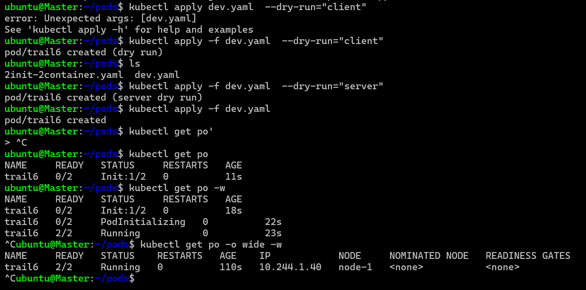
* __sidecar enhance addons feature like log monitoring__
* if your application doesnt have any pri-condition so dont write init containers, if has then write otherwise no need.

* Exercise:
* try to fail init 2 by cmd exit 1 i.e. error code observe the behavior


* Purpose of init containers: to configure any preconditions for running your applications in container 
     * changing configuration values
     * data correctness check
     * migrate data (orm to db data creation)
 
* controller objects: they ensure pods are running which include
     * Replicasets 
     * Replication Controller
     * Daemonsets
     * Deployments


# Labels

* refer: https://kubernetes.io/docs/concepts/overview/working-with-objects/labels/

* Example labels:
```yaml

"release" : "stable", "release" : "canary"
"environment" : "dev", "environment" : "qa", "environment" : "production"
"tier" : "frontend", "tier" : "backend", "tier" : "cache"
"partition" : "customerA", "partition" : "customerB"
"track" : "daily", "track" : "weekly"

# These are examples of commonly used labels; you are free to develop your own conventions. Keep in mind that label Key must be unique for a given object.
```

* A label in kubernetes is a name value pair
* Because this is the only query or filter mechanism

* Kubernetes labels are key-value pairs attached to Kubernetes objects, such as pods. They are like tags that help you organize and manage your resources.
* Label Selectors: Label selectors are used for grouping objects, specifying requirements that determine which objects the labels must be applied to. The Kubernetes API supports equality-based and set-based selectors46.

Example: In a YAML file, labels are defined under the metadata section:

```yaml

apiVersion: v1
kind: Pod 
metadata:
  name: nginx-pod
  labels:
    app: frontend
    env: dev
```
* In this example, app: frontend means the pod is part of the "frontend" application.

* k8s trys to forward the request to any pods which has these orange lables
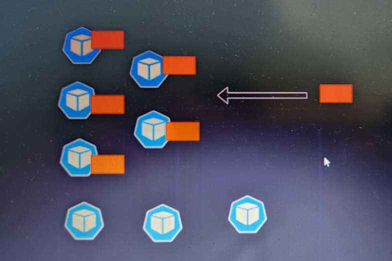
* k8s groups the objects with the hepl of labels 
* k8s never try to tell that forward this request to the  pod which has these containers inside this 

* k8s stores the data of objects in etcd and it fetches the data of related objects with the help of labels
* Label in k8s is a key value used to group objects logically
* or official docs: https://kubernetes.io/docs/concepts/overview/working-with-objects/labels/
* labels can be selected/queried by two types of queries
     * equality operators: Refer: https://kubernetes.io/docs/concepts/overview/working-with-objects/labels/#equality-based-requirement
     * equals (=) and 
     * not equals (!=)
     * set based operators : https://kubernetes.io/docs/concepts/overview/working-with-objects/labels/#set-based-requirement
          * in 
          * not in

# trail 6   

* Create a pod manifest with the following labels
     * env = dev 
     * app = nginx
     * version = 1.0
     * for the manifest
```yaml
---
apiVersion: v1
kind: Pod
metadata:
  name: trail6
  labels:
    env: dev
    app: nginx
    version: "1.0"
spec:
  containers:
    - name: nginx
      image: nginx
      resources:
        limits:
          cpu: 500m
          memory: 512Mi

```
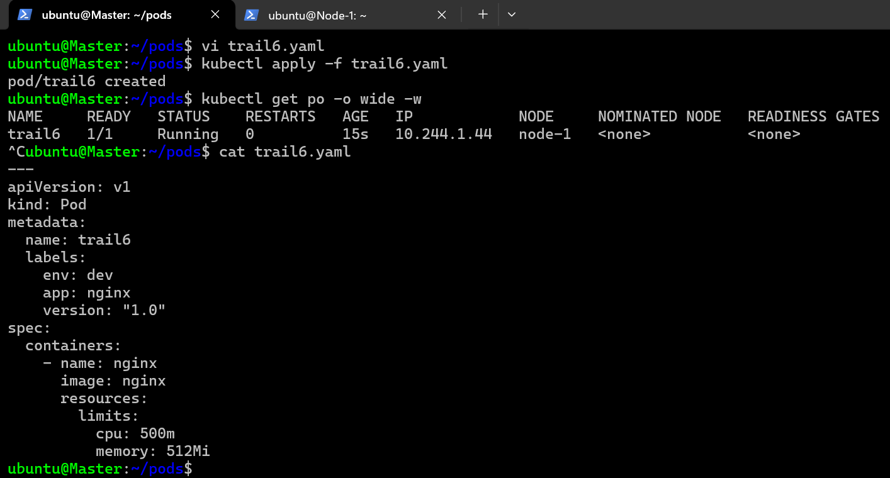

# Replica Set

* __in metadata section we write a label for replicaset and in template we write a label for pod__
* __selector: the lables which will select your pod__
* __with the help of template you are going to create a pod__
* __You are going to create a pod using a ReplicaSet. The specification of the pod will be described in the template. (replicaset ko use kareke aap pod banane wale ho o pod ka specification kya hai o template me batao ge)__

* for official docs: https://kubernetes.io/docs/concepts/workloads/controllers/replicaset/

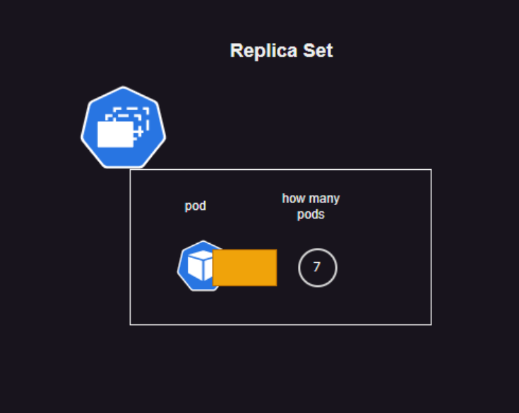

# Trail 1

* Create 3 nginx pods in a replica set with manifest

```yaml
---
apiVersion: apps/v1
kind: ReplicaSet
metadata:
  name: trail1-rs
  labels: 
    name: trail
spec: 
  minReadySeconds: 10 
  replicas: 3 
  selector: 
    matchLabels: 
      app: nginx 
  template: 
    metadata:  
      labels: 
        app: nginx 
        env: dev
        version: "1.0"
    spec: 
      containers:
        - name: nginx 
          image: nginx 
          resources: 
            limits: 
              cpu: 500m
              memory: 512Mi
```

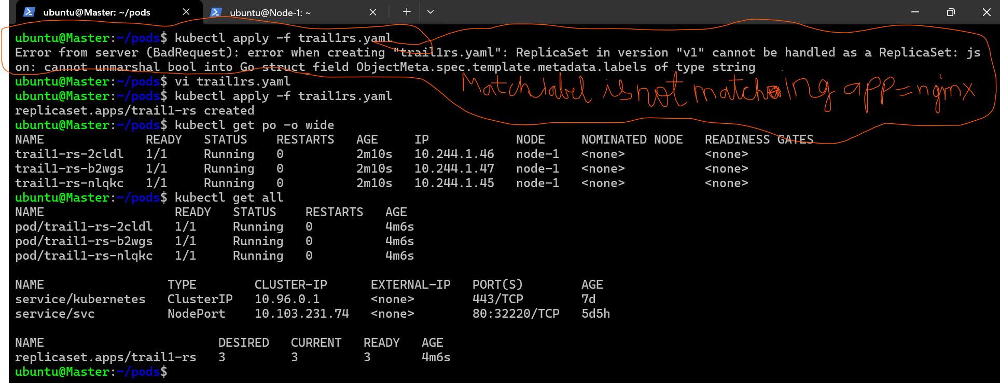
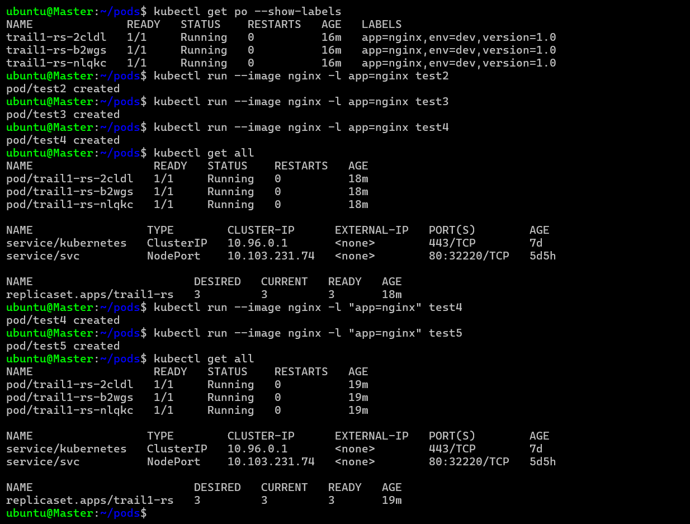


# trail 2

* create 3 pods manually with label app=nginx and then create the rs from trail1
* replicaset will not create a new pod as long as manual pods created above are running as the desired is already met


# Exercise

* create a replicaset with pod spec running alpine container without any args

```yaml
---
apiVersion: apps/v1
kind: ReplicaSet
metadata: 
  name: exercise1
  labels:
    app: exercise1
spec:
  minReadySeconds: 5
  replicas: 3
  selector:
    matchExpressions: 
      - key: xyz 
        operator: In 
        values: 
          - exercise1
          - exercise2
  template:
    metadata:
      name: exercise1
      labels: 
        xyz: exercise1
    spec: 
      containers:
        - name: withoutargs
          image: alpine
          resources:
            requests: 
              memory: "64Mi"
              cpu: "250m"
            limits:    
              memory: "128Mi"
              cpu: "500m"

```

# Replication Controller (RC)

* __Replicaset__ is the replacement for __Replication controller (RC)__

* RC can perform only equavality based label selections on Pods where as RS supports set based criteria
* RS supports rolling updates which is used in Deployments, (RS is used by Higher objects such as Deployments and Daemonsets supporting zero downtime deployments)

# Trail3

* Create a manifest for ReplicationController with 3 nginx pods with label `app=nginx`


Scaling Applications in k8s
-------------------------------

* We deploy an individual service on a pod, when we want to scale our applicaton, we scale pods not containers

* To deal with scaling and other aspects of managing applications lets look at other workloads which are generally referred as controllers,

* Workloads
  * ReplicaSet (Replication Controller)
  * Deployment
  * Jobs (CronJobs)
  * Statefulsets

#