# Exercise- Replicaset

# `kubectl delete rs --all` delete replicaset 
* `kubectl delete -f trail1.yaml`
* `kubectl delete pod test1 test2 trail2`

# `kubectl delete service apache-svc nginx-svc`
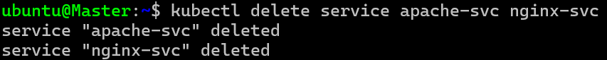

* create a replicaset with pod spec running alpine container without any args 

```yaml
---
apiVersion: apps/v1
kind: ReplicaSet
metadata: 
  name: exercise1
  labels:
    app: exercise1
spec:
  minReadySeconds: 5
  replicas: 3
  selector:
    matchExpressions: 
      - key: xyz 
        operator: In 
        values: 
          - exercise1
          - exercise2
  template:
    metadata:
      name: exercise1
      labels: 
        xyz: exercise1
    spec: 
      containers:
        - name: withoutargs
          image: alpine
          resources:
            requests: 
              memory: "64Mi"
              cpu: "250m"
            limits:    
              memory: "128Mi"
              cpu: "500m"


```
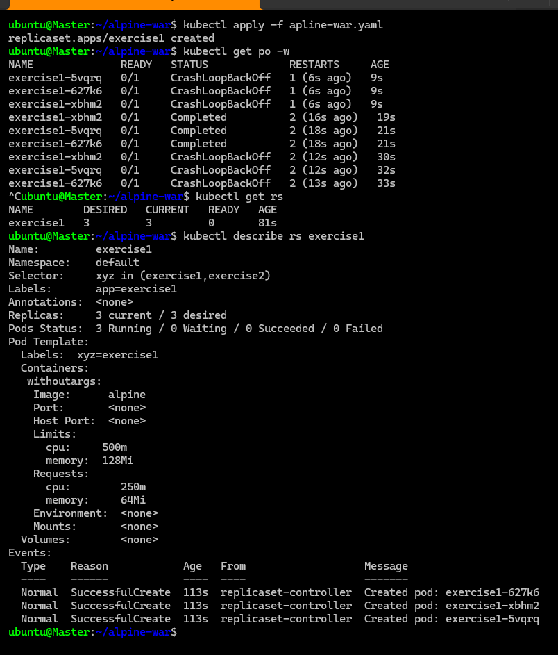
* i want to create a replicaset with nginx and want to access them from browser 

# service 

* service get fixed ip because its maintain by control plane and its a virtual ip and its a rule not changing service ip and pods get always new ip if it will be delete coz after delete the pod it will create a new pod and it will get new ip.  
* The port onwhich your application is running is called targetport.
* __service is a collection of ip address with port combination this is something k8s called as Endpoints__
* __service basically forward the request to the Pods with the help of labels.__
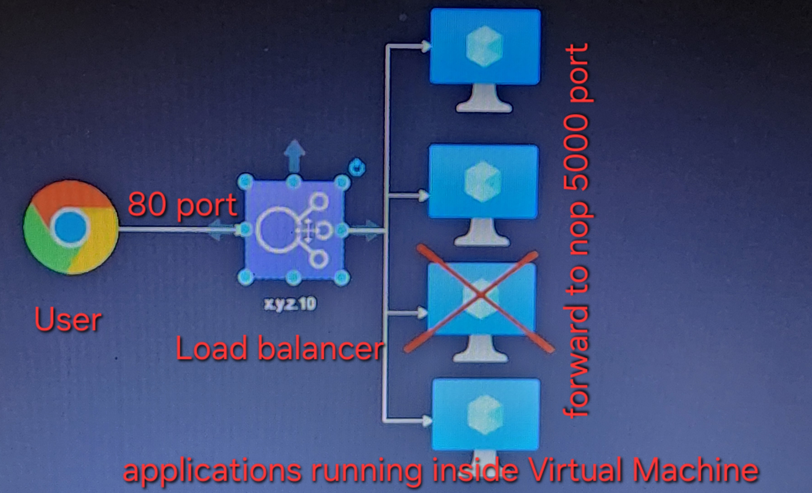
* user will use load balancer ip address to access application which is running in vartual machine , no matter how many vm is currenty ruuning application in its like 4 or 400 vm is there. 
* __default service is internal in nature that means (accessable only within the k8s network )this service cannot be access from outside cluster__
image
* __if you write same selector in pod and service file then its only work other wise not work__.
* in k8s a service is a method for exposing a network application that is running as one or more Pods in your cluster.
* refer:  https://kubernetes.io/docs/concepts/services-networking/service/

# Trail 1:

* create a service to forward rhe request to 80 port of nginx pods with labels `app=nginx` 

```yaml
---
apiVersion: apps/v1
kind: ReplicaSet
metadata:
  name: nginx-rs
  labels:
    purpose: understanding 
spec:
  minReadySeconds: 5
  replicas: 3
  selector:
    matchLabels:
        app: nginx 
  template:
    metadata: 
      name: nginx-rs
      labels:
        app: nginx
        version: v1.0
    spec:
      containers:
        - name: nginx-rs-c
          image: nginx 
          ports:
            - containerPort: 80
---
apiVersion: v1 
kind: Service
metadata: 
  name: nginx-svc
spec: 
  selector:
    app: nginx 
  ports: 
    - name: nginx-port
      port: 80
      targetPort: 80 

```
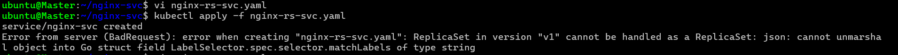
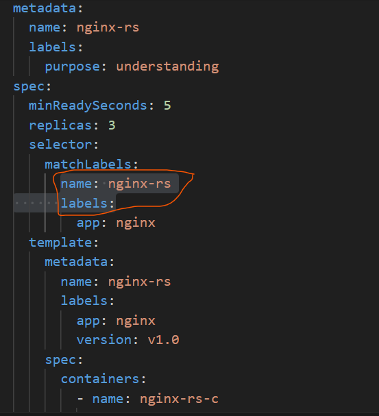
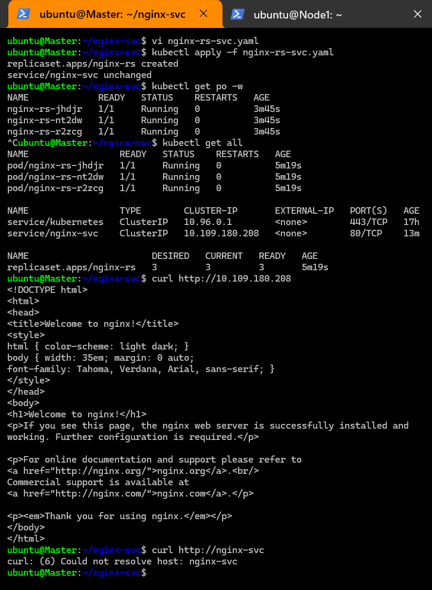
 * now create a alpine pod with sleep 1d 

```
apiVersion: v1 
kind: Pod 
metadata:
  name: trail2
spec:
  containers:
    - name: alpine1d
      image: alpine 
      args:
        - sleep 
        - 1d
          

```
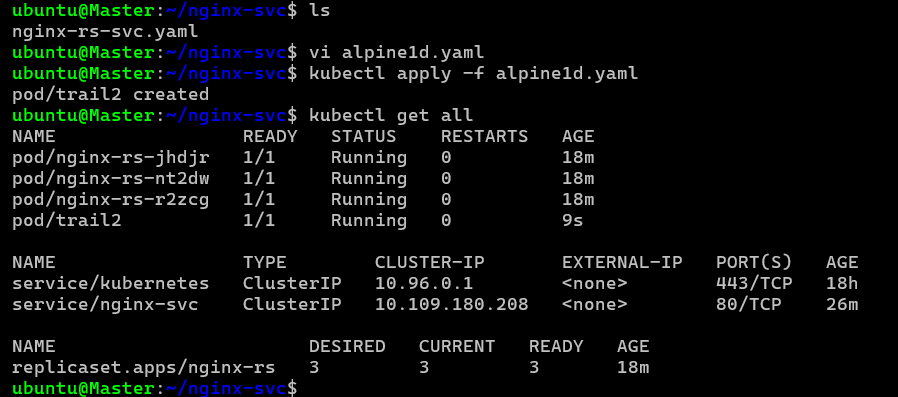
* now get into the trail2 pod with the help of below command
* `kubectl exec -it trail2 -- /bin/sh`
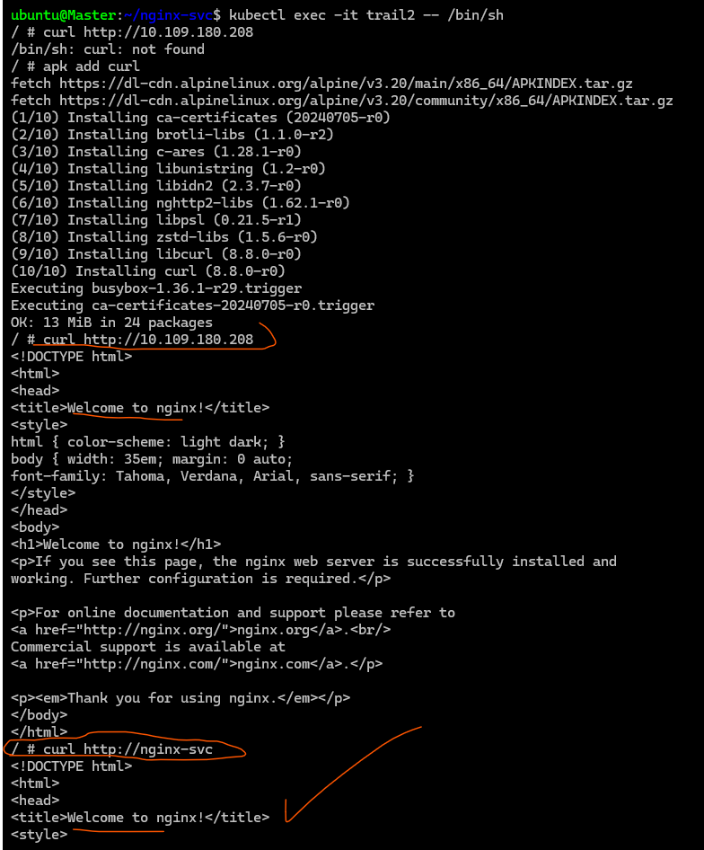
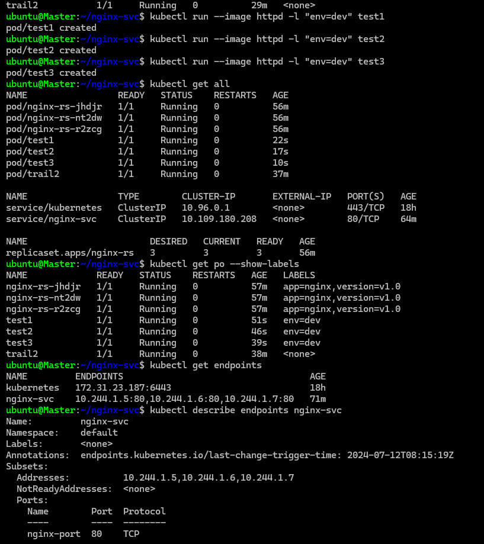
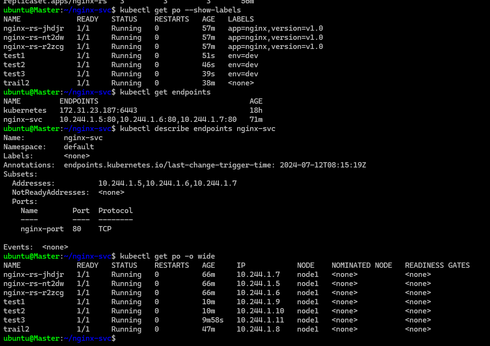


* __`targetport` is where your application is running__
* __service is a collection of `endpoints`__
* __`endpoints` is a ip of pod and port combinations where is your application is running__

* # Trail 2:

* create a replicaset with 3 httpd pods 
* create a service (svc) with some matching labels 

```
---
apiVersion: apps/v1
kind: ReplicaSet
metadata:
  name: httpd-rs
  labels:
    purpose: understanding
spec: 
  minReadySeconds: 5
  replicas: 3
  selector:
    matchLabels:
      app: httpd
  template: 
    metadata:
      labels:
        app: httpd
        env: dev
        version: v1.0
  spec: 
    containers:
      - name: apache-c 
        image: httpd 
        ports: 
          - containerPort: 80
        resources:
          requests:
            memory: "64Mi"
            cpu: "250m"
          limits:
            memory: "128Mi"
            cpu: "500m"
---
apiVersion: v1
kind: Service
metadata:
  name: apache-svc 
spec:
  selector: 
    app: httpd
  ports: 
    - port: 80 
      targetPort: 80


```
* you can apply your manifest file direct with folder name. like ` kubectl apply -f trail2/` show in below image
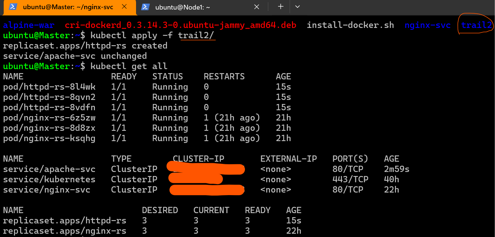
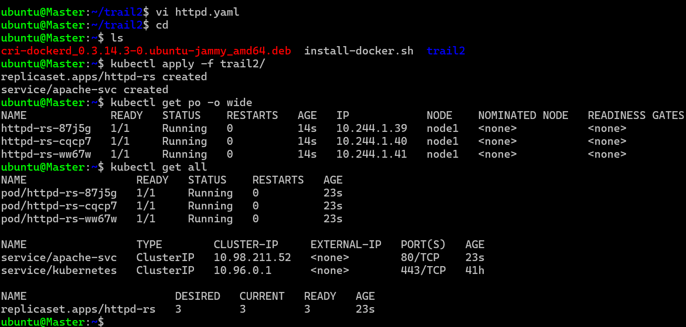

* when we create service, service creates endpoint which all the ip-addresses of matching pods 
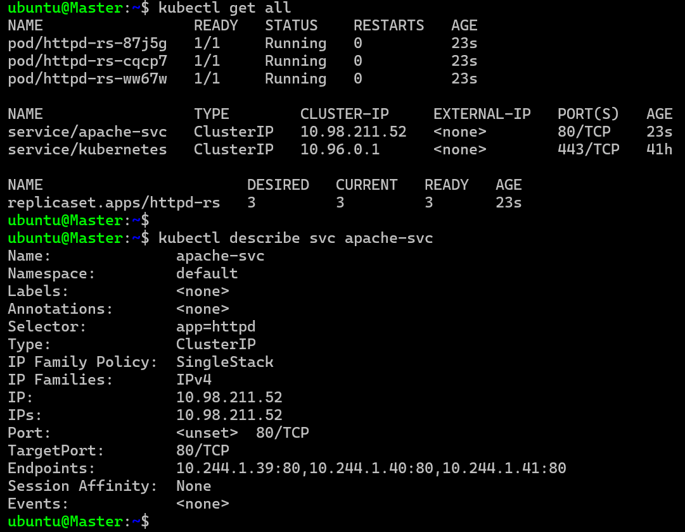


* ## expose 

* refer: https://kubernetes.io/docs/reference/kubectl/generated/kubectl_expose/
  
* `kubectl expose service apache-svc --port 5000 --target-port 80 --name test-apache`
* 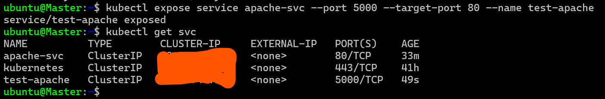
  
* if we want to access the svcfrom outside or use node-network we have 2 options
      * __temporary__: `kubectl port-forward or --help`
      * 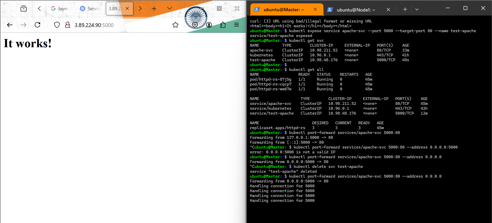
      * kubectl por-forward service/apache-svc 5000:80 --address 0.0.0.0
      * __continued access__: for this we need to understand service types in k8s 
* `kubectl port-forward services/apache-svc 5000:80` its just for checking is this working or not then will be this is used.
* https://kubernetes.io/docs/concepts/services-networking/service/#publishing-services-service-types
  

* # Service types 


* k8s service is of 4 types refer: https://kubernetes.io/docs/concepts/services-networking/service/#publishing-services-service-types
  
      * cluster ip: 
         * this gives private access with in k8s cluster 
        
      * nodeport: 
      * `In Kubernetes, a NodePort service is exposed for every node in the cluster using the nodePort field in the service definition, which can be either user specified or automatically assigned. By default, the nodePort is allowed to be in a range between 30000 and 32767.`
         * k8s service can be exposed on a specific port `(30000-32767)` on all nodes of k8s cluster 
         
      * load balancer: This used generally by managed k8s clusters `(EKS, AKS,)`, This create a cloud load balancer 
      
      * enternalName: 

* # Trail 2 Continued:

* Modify the service to expose the apache service on port 30000 

```
---
apiVersion: apps/v1
kind: ReplicaSet
metadata:
  name: httpd-rs
  labels:
    purpose: understanding
spec:
  minReadySeconds: 5
  replicas: 3
  selector:
    matchLabels:
      app: httpd
  template:
    metadata: 
      labels:
        app: httpd
        env: dev 
        version: v1.0
    spec:
      containers: 
        - name: apache
          image: httpd
          ports: 
            - containerPort: 80
---
apiVersion: v1
kind: Service
metadata: 
  name: apache-svc
spec: 
  type: NodePort
  selector: 
    app: httpd
  ports:
    - name: apache
      nodePort: 30000 
      port: 80
      targetPort: 80

```
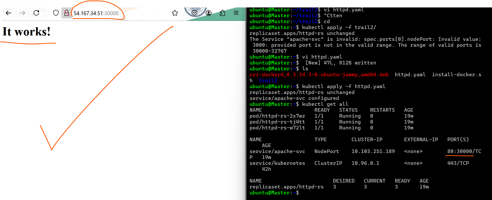

* # Trail3

* Create a replicaset with spring petclinic image `redfiree/spc-project:latest` or `shaikkhajaibrahim/spcjan2024:1.0`
  
```
* this all commands is use to check pods in details
* `kubectl describe rs spc-rs`
* `kubectl describe pod spc-rs-754k6`
* to go inside pod `kubectl exec -it spc-rs-754k6(pod name) -- /bin/sh`
* inside pode type command `ps aux` 
* `apk add curl` `curl http://localhost:8080` `curl http://spc-svc(service name):8080`

```
  * This runs on 8080 port
  * Now create 3 replicas of this
  * label suggestions:
          * app: spc
          * end: dev
          * version: 3.4.0

```
---
apiVersion: apps/v1
kind: ReplicaSet
metadata:
  name: spc-rs
spec:
  minReadySeconds: 5
  replicas: 3
  selector:
    matchLabels:
      app: spc 
  template:
    metadata:
      name: spc
      labels:
        app: spc 
        env: dev
        version: v3.4
    spec: 
      restartPolicy: Always
      containers:
        - name: spc-c
          image: redfiree/spc-project:latest
          ports:
            - containerPort: 8080
          resources:
            requests: 
              memory: "512Mi"
              cpu: "500m"
            limits:
              memory: "1Gi"
              cpu: "1000m"
---
apiVersion: v1
kind: Service
metadata: 
  name: spc-svc
spec: 
  type: NodePort
  selector: 
    app: spc 
  ports:
    - name: spc 
      port: 8080
      targetPort: 8080
      nodePort: 31000

```


* Create a service of type cluster ip
* expose this to the outside world on port 31000 using node port

```
---
apiVersion: v1
kind: Service
metadata: 
  name: spc-svc
spec: 
  type: NodePort
  selector: 
    app: spc 
  ports:
    - name: spc 
      port: 8080
      targetPort: 8080
      nodePort: 31000

```


# Exercises
* figure out the purpose of /etc/resolve.conf  ? 
# Load balancer
* refer: https://medium.com/@harishramkumar/difference-between-layer-4-vs-layer-7-load-balancing-57464e29ed9f
