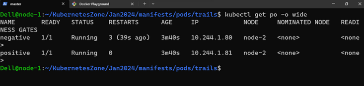

## k8s contd

* __Kube-proxy__

* kube-proxy is responsible for cluster level networking.
* while CNI is responsible for low level networking on Pod.
* kube-proxy which is present on each node helps in Service level abstractions such as node-port, node to pod, pod to pod, pod to service connections.
* kube-proxy manages ipTables and makes routing possible.

# Deployments

* refer: https://kubernetes.io/docs/concepts/workloads/controllers/deployment/

* 
  
* __strategy__: 
      * recreate
      * rollingUpdates  
* refer: https://kubernetes.io/docs/concepts/workloads/controllers/deployment/#strategy

* Demonstrate  deployment with some example 

```yaml
---
apiVersion: apps/v1
kind: Deployment
metadata:
  name: nginx-deploy
spec: 
  minReadySeconds: 10
  replicas: 4
  selector:
    matchLabels:
      app: nginx
  strategy: 
    type: RollingUpdate
    rollingUpdate: 
      maxSurge: 25%
      maxUnavailable: 25%
  template: 
    metadata: 
      labels:
        app: nginx
        version: "v1.0"
    spec:
      containers: 
        - name: nginx-c
          image: nginx 
          ports: 
            - name: nginx 
              containerPort: 80

---
apiVersion: v1 
kind: Service
metadata:
  name: nginx-svc
spec:
  type: NodePort
  selector: 
    app: nginx 
  ports: 
    - name: nginx
      port: 80
      targetPort: 80
      nodePort: 30002

```
 the manifest

* Apply the manifest


* Lets review some additional commands
* `kubectl rollout status deployments/nginx-deploy` or `kubectl rollout history deployments/nginx-deploy`
* 
  
* Now lets make some changes in the manifest Refer Here for changes

```yaml
---
apiVersion: apps/v1
kind: Deployment
metadata:
  name: nginx-deploy
spec: 
  minReadySeconds: 10
  replicas: 4
  selector:
    matchLabels:
      app: nginx
  strategy: 
    type: RollingUpdate
    rollingUpdate: 
      maxSurge: 25%
      maxUnavailable: 25%
  template: 
    metadata: 
      labels:
        app: nginx
        version: "v1.0"
    spec:
      containers: 
        - name: nginx-c
          image: httpd
          ports: 
            - name: nginx 
              containerPort: 80
          resources: 
            limits: 
              memory: "2Gi"
              cpu: "2"

---
apiVersion: v1 
kind: Service
metadata:
  name: nginx-svc
spec:
  type: NodePort
  selector: 
    app: nginx 
  ports: 
    - name: nginx
      port: 80
      targetPort: 80
      nodePort: 30002

```

* Now lets assume you didnt like the release and want to go back to previous version (revision=1)

  

* # Trail 2

* Write a  deployment spec for jenkins with rolling updates  
     * surge: 40 %
     * unavailable: 40%
     * replicas = 10

```
---
apiVersion: apps/v1
kind: Deployment
metadata:
  name: trail2-deploy
spec:
  minReadySeconds: 30
  progressDeadlineSeconds: 600
  replicas: 10
  selector:
    matchLabels:
      app: jenkins
  strategy:
    type: RollingUpdate
    rollingUpdate:
      maxSurge: 40%
      maxUnavailable: 40%
  template:
    metadata:
      labels:
        app: jenkins
        ver: "v1.0"
    spec:
      containers:
        - name: jenkins
          image: jenkins/jenkins:jdk-11
          resources:
            limits:
              cpu: 2000m
              memory: 2Gi
          ports:
            - containerPort: 8080
---
apiVersion: v1
kind: Service
metadata:
  name: jenkins-svc
spec:
  selector:
    app: jenkins
  type: NodePort
  ports:
    - name: jenkins
      targetPort: 8080
      port: 8080
      nodePort: 31000

```

* ## Probes in Pods

* refer: https://kubernetes.io/docs/tasks/configure-pod-container/configure-liveness-readiness-startup-probes/

* # Liveness, Readiness and Startup Probes 

* K8s gives the following probes

* __liveness probe__ : 

* Purpose: To see if a container is still running properly. 
* What it does: If the check fails, Kubernetes restarts the container.
* When to use it: Use it to detect and fix situations where an application gets stuck or crashes.
* Example: Checking if an application is responding to a health check endpoint.
* Liveness Check: Checks every 3 seconds if the application is alive.

* This determines whether the application in container is started correctly. If this check fails,  k8s will try to restart the container according to restartPolicy.
*  If a liveness check fails, Kubernetes will restart the container to try to recover it.

* __Readiness probe__ :

* Purpose: To see if a container is ready to handle requests.
*  If the check fails, Kubernetes stops sending traffic to the container but does not restart it.
*  When to use it: Use it to ensure the application is fully started and ready to serve requests.
* Example: Checking if an application has finished loading data or initializing.
* Readiness Check: Checks every 5 seconds if the application is ready to handle requests.

*  This determines whether the container is ready to serve requests. if this check fails, the service will not forward the requests to the pod
*  If a readiness check fails, Kubernetes will remove the container's IP address from the service endpoints, preventing it from receiving traffic.

* __startup probe__: This is added for slow starting  applications, till startup probe is completed, liveness probes will not be executed.

# Restart vs. Removal: 
   *  `Liveness probe` failure restarts the container, while
   *   `readiness probe` failure only removes the pod from the service endpoints.

* __Types of checks__ : 
       * exec
       * grpc
       * httpGet
       * tcpSocket  

* Lets write a Pod spec with basic checks
   
   * liveness check postive and negative: 

```
---
apiVersion: v1
kind: Pod
metadata:
  name: positive
  labels:
    app: nginx
spec:
  containers:
    - name: nginx
      image: nginx
      ports:
        - containerPort: 80
      resources:
        limits:
          cpu: 500m
          memory: 256Mi
      livenessProbe:
        httpGet:
          path: /
          port: 80

---

---
apiVersion: v1
kind: Pod
metadata:
  name: negative
  labels:
    app: nginx
spec:
  containers:
    - name: nginx
      image: nginx
      ports:
        - containerPort: 80
      resources:
        limits:
          cpu: 500m
          memory: 256Mi
      args:
        - sleep
        - 1d
      livenessProbe:
        httpGet:
          path: /
          port: 80
```



* Refer Here for the manifest with positive and negative readiness probes

```
---
apiVersion: v1
kind: Service
metadata:
  name: check-svc
spec:
  type: ClusterIP
  selector:
    app: nginx
  ports:
    - name: apache
      port: 80
      targetPort: 80

---
apiVersion: v1
kind: Pod
metadata:
  name: positive
  labels:
    app: nginx
spec:
  containers:
    - name: nginx
      image: nginx
      ports:
        - containerPort: 80
      resources:
        limits:
          cpu: 500m
          memory: 256Mi
      livenessProbe:
        httpGet:
          path: /
          port: 80
      readinessProbe:
        httpGet:
          path: /
          port: 80

---
apiVersion: v1
kind: Pod
metadata:
  name: negative
  labels:
    app: nginx
spec:
  containers:
    - name: nginx
      image: nginx
      ports:
        - containerPort: 80
      resources:
        limits:
          cpu: 500m
          memory: 256Mi
      livenessProbe:
        httpGet:
          path: /
          port: 80
      readinessProbe:
        httpGet:
          path: /admin
          port: 80

```


* # Exercises

* Try to write a pod manifest for any  application with web interface 
   
   * spring petclinic
   * nop
   * apache
   * httpd
   * tomcat 

* Ensure your manifests always have 
   
   * resources
   * probes
   * ports

* Now try making a replicaset,  deployment and expose using service.

* ## write a deployment spec 
  * write apache container and alpine pod with sleep 1d
  * write health check for apache
         * readiness
  * expose the application to 31000 on all nodes 
  * ensure we have 3 replicas  
 * manifest
  
```
---
apiVersion: apps/v1
kind: Deployment
metadata:
  name: apache-deploy
spec: 
  minReadySeconds: 10
  replicas: 4
  selector:
    matchLabels:
      app: apache
  strategy: 
    rollingUpdate: 
      maxSurge: 25%
      maxUnavailable: 25%
  template:
    metadata:
      labels:
        app: apache
    spec:
      containers: 
        - name: apache
          image: httpd 
          ports: 
            - name: apache-port
              containerPort: 80
          readinessProbe:
            httpGet: 
              path: /
              port: 80
            initialDelaySeconds: 10
            periodSeconds: 5
            successThreshold: 1
        - name: alpine-sleep
          image: alpine 
          args:
            - sleep
            - 1d
---
apiVersion: v1
kind: Service
metadata:
  name: apache-svc
spec:
  type: NodePort
  selector:
    app: apache
  ports: 
    - name: apache-port
      port: 80
      targetPort: 80
      nodePort: 31000
    - name: alpine-port
      port: 8080
      targetPort: 8080
      nodePort: 31001

```


* # vi editor 
* `:%d` `enter` to delete 1 shot content of vi 