# Managed Kubernetes (Kubernetes as a Service)

* All the CSP offer k8s as a service 

      * AWS = EKS
      * Azure = AKS
      * GCP = GKE

* Architecture of k8s as a service

* All the clouds manage control plane and charge hourly for that
* Nodes can be added by us at normal virtual machine costs

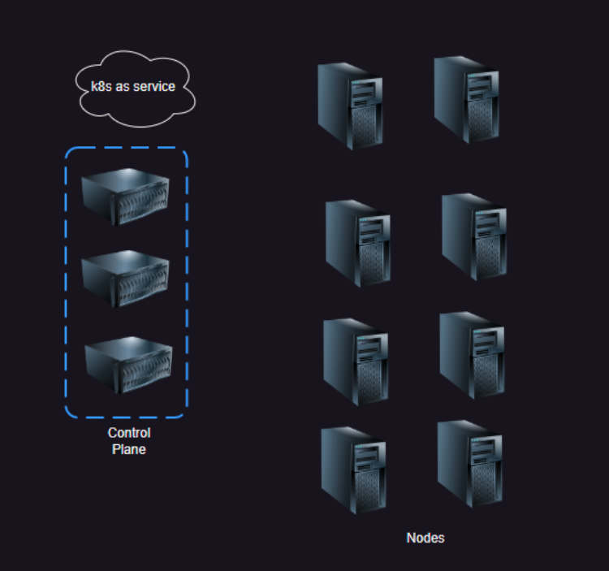


* # `manage k8s free trail` search on web
* installing cli on ubuntu search on web

* K8s as a service provides node autoscaling
* They provide options for 
      * __Networking__
          
           * integrate with cloud load balancers
           * integrate with cloud virtual networks
           * support for layer 7 load balancing with ingress
           * support for third party cni
     
      * __Storage__   
      
           * Volume integration with cloud based disk storages and other storage options
           
     *  __Authentication and authorization (A & A)__ 
           
           * support k8s native A & A
           * extends A & A to cloud based IAM
   
     *  __Administration:__
      
           * Backup of k8s clusters
           * Upgrading k8s clusters
    
     *  __Pod based billing__

# AKS: Azure kubernetes Cluster


* for official docs of Azure kuberentes service. 
* refer: https://learn.microsoft.com/en-us/azure/aks/

*  for quick start to create aks cluster
*  refer: https://learn.microsoft.com/en-us/azure/aks/learn/quick-kubernetes-deploy-cli 

* 1} install azure cli in windows  
     * via azure docs or chocolatey  
  
# 2} create azure account and login 

* follow the steps 

     * login to terminal with your vm crediantials
        
        * install azure cli on ubuntu vm (i am installing via script based option)
        * ` curl -L https://aka.ms/InstallAzureCli | bash` 
       
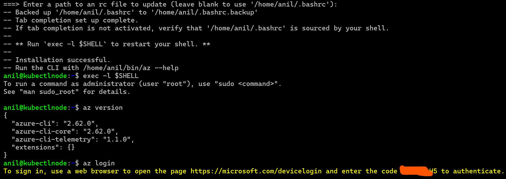
        
   * Then enter 1
      
       * `Select a subscription and tenant (Type a number or Enter for no changes): 1`  
       
       * after successfully login now __Create a resource group__
       
       * `az group create --name myResourceGroup --location southindia`
     
       * __Now Create an AKS cluster__
       
       * `az aks create --resource-group myResourceGroup --name myAksCluster --enable-managed-identity --node-count 1 --generate-ssh-keys`   
       
       * check `kubectl version`
       
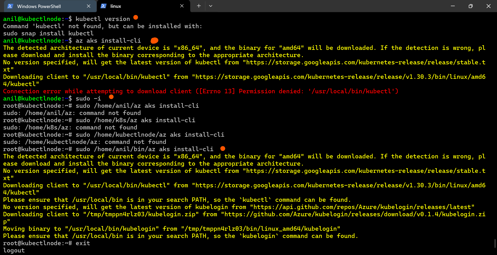
       
   *   * __Connect to the cluster__ 
   
       *  `sudo /home/anil/bin/az aks install-cli` 
       *  ` exit`
       *  `kubectl version`
       
       * To manage a Kubernetes cluster, use the Kubernetes command-line client, kubectl. kubectl is already installed if you use Azure Cloud Shell. To install kubectl locally, use the `az aks install-cli` command.   
       
       * Configure kubectl to connect to your Kubernetes cluster using the az aks get-credentials command. This command downloads credentials and configures the Kubernetes CLI to use them.
       
       * `az aks get-credentials --resource-group myResourceGroup --name myAksCluster`
       
       * Verify the connection to your cluster using the kubectl get command. This command returns a list of the cluster nodes.
       
       * `kubectl get nodes`  
  
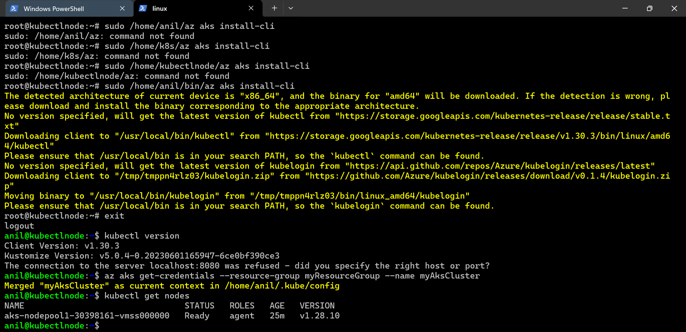

  *    * __Kubectl autocomplete__
  
       * `source <(kubectl completion bash)` # set up autocomplete in bash into the current shell, bash-completion package should be installed first.
       
       * `echo "source <(kubectl completion bash)" >> ~/.bashrc`  # add autocomplete permanently to your bash shell.
     
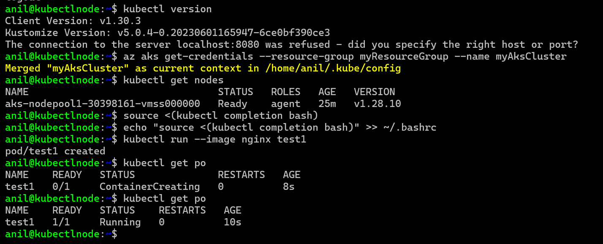   
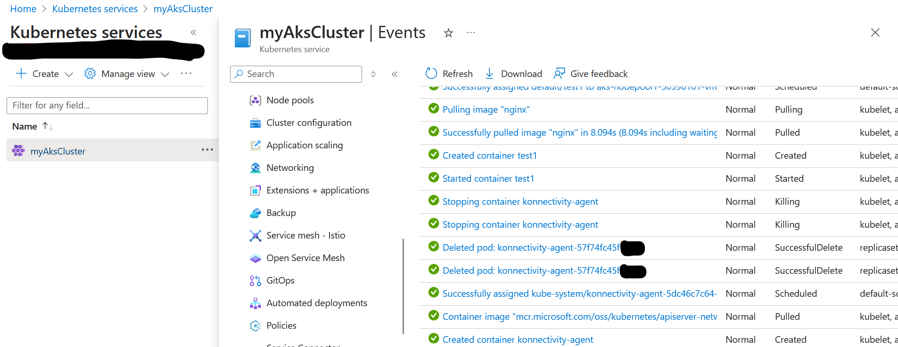 

  *    * to  Delete an Azure Kubernetes Service (AKS) cluster
      
       * `az aks delete --name myAKSCluster --resource-group myResourceGroup`    

* 

* # Namespaces

* Namespace is a logical cluster for organizing k8s resources.

* By default in k8s cluster we have following namespaces 
      * default
      * kube-system
      * kube-public

* Kuberentes resources can be scoped to a 
      * namespace (namespaced = true)
      * cluster (namespace = false)

#

* __anything with a namespaced with a `true` will belongs to the namespaced__

* __anything with a namespaced with a `false` will belongs to the cluster__

# 

* use th namespaced section in `kubectl api-resources` in terminal to find out the scope    
      * examples of namespace scope 
         
          * pods
          * services
          * deployments
          * .....
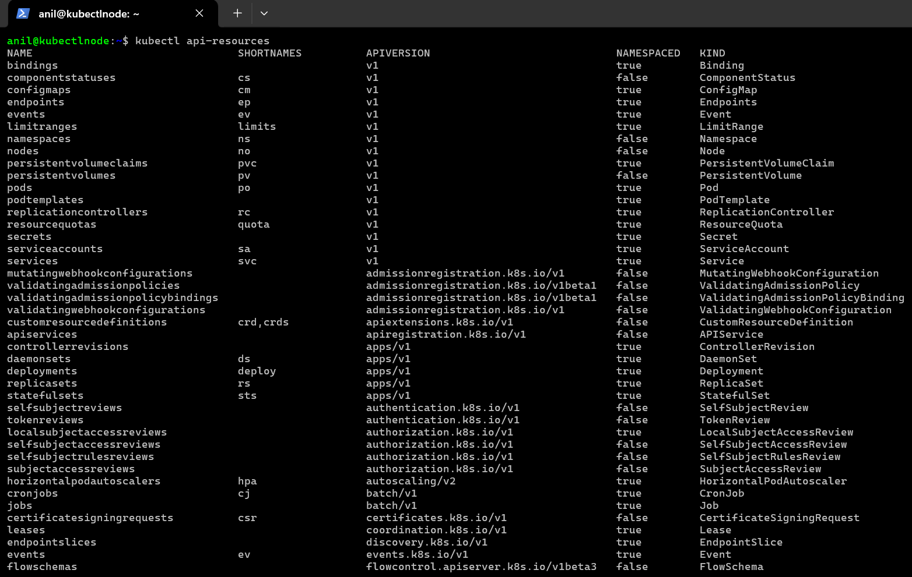
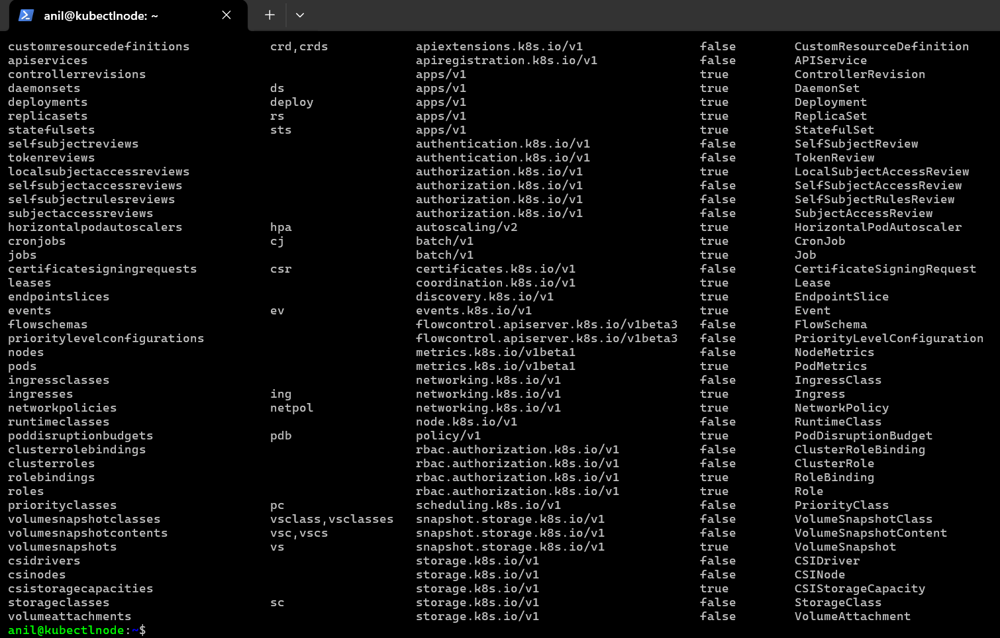

* figure out which version you are using and try to stick with that k8s docs.

* in my case my Client Version: v1.30.3 and my Server Version: v1.28.10 so i must go with k8s Version: v1.28.10.
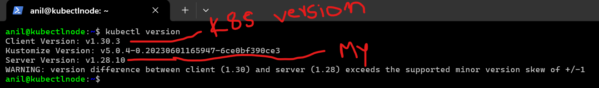


* examples of cluster scope  
      * node
      * persistent volumes

* Namespaces are generally used to 
      * differentiate environments
      * assign resource limits to the namespaces

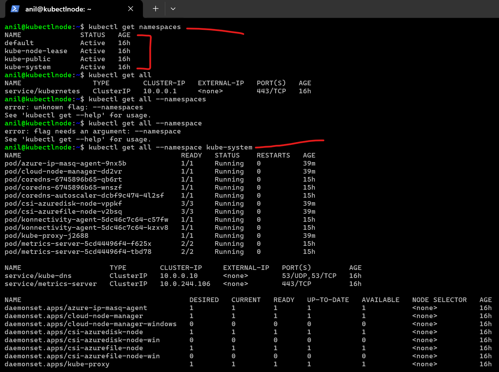

# creating namespace 

* ns.yaml
```
apiVersion: v1
kind: Namespace
metadata:
  name: dev 
```
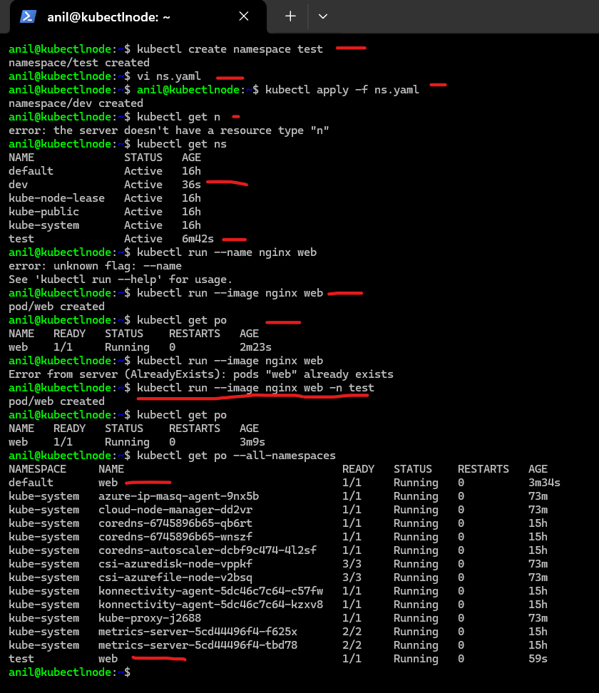

* so with the help of  namespaces we can create multiple pods with same name  by using 
* kubectl command can query the default namespace 
* Refer Here: https://kubernetes.io/docs/concepts/overview/working-with-objects/namespaces/


## Created Namespaces:

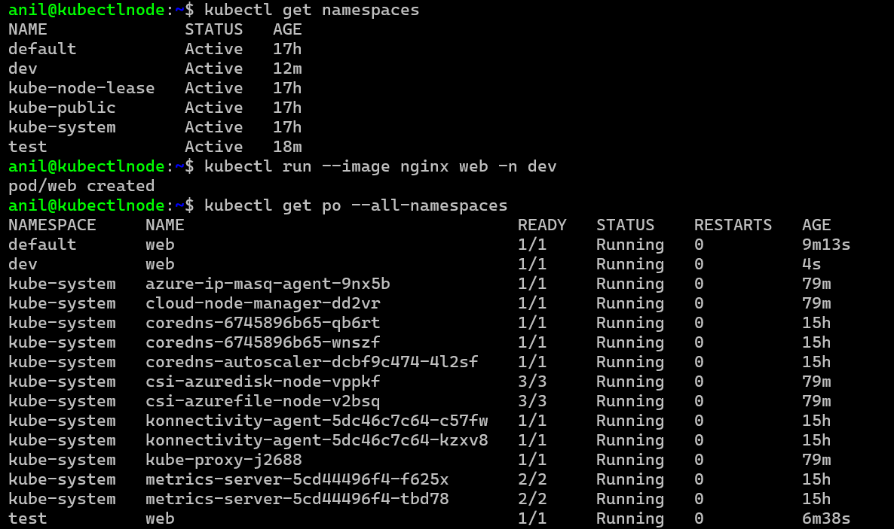
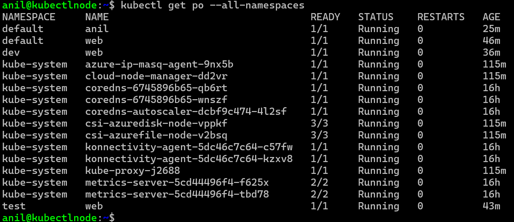

```
kubectl create namespace test
Created a namespace named test.
Applied ns.yaml to create a dev namespace.
Checked Namespaces:

kubectl get ns
Listed all active namespaces.
Ran Pods:

Tried to run an nginx pod with --name flag (error: flag not supported).
Successfully ran an nginx pod named web in the default namespace.
Attempted to run another nginx pod named web in the default namespace (error: pod already exists).
Successfully ran an nginx pod named web in the test namespace.
Checked Pods:

kubectl get po
Listed pods in the current namespace (default).
kubectl get po --all-namespaces
Listed pods across all namespaces.
Conclusion:
Namespaces help organize and isolate resources within your Kubernetes cluster. You can have separate environments like dev, test, and production within the same cluster, which helps manage resources and access controls effectively.
```
# Delete Namespaces

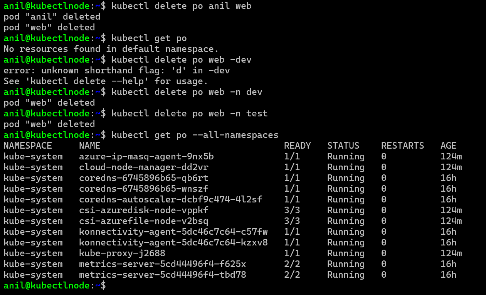
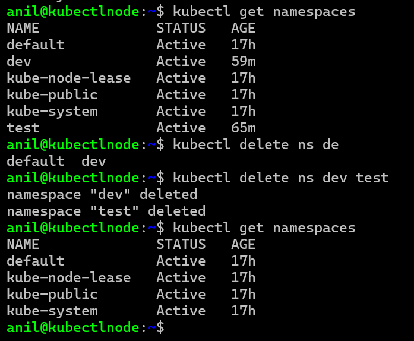

# Setting the namespace preference

* You can permanently save the namespace for all subsequent kubectl commands in that context.
* `kubectl config set-context --current --namespace=<insert-namespace-name-here>`

* Before 
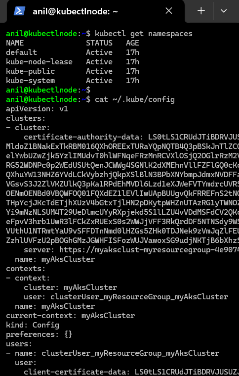

* After
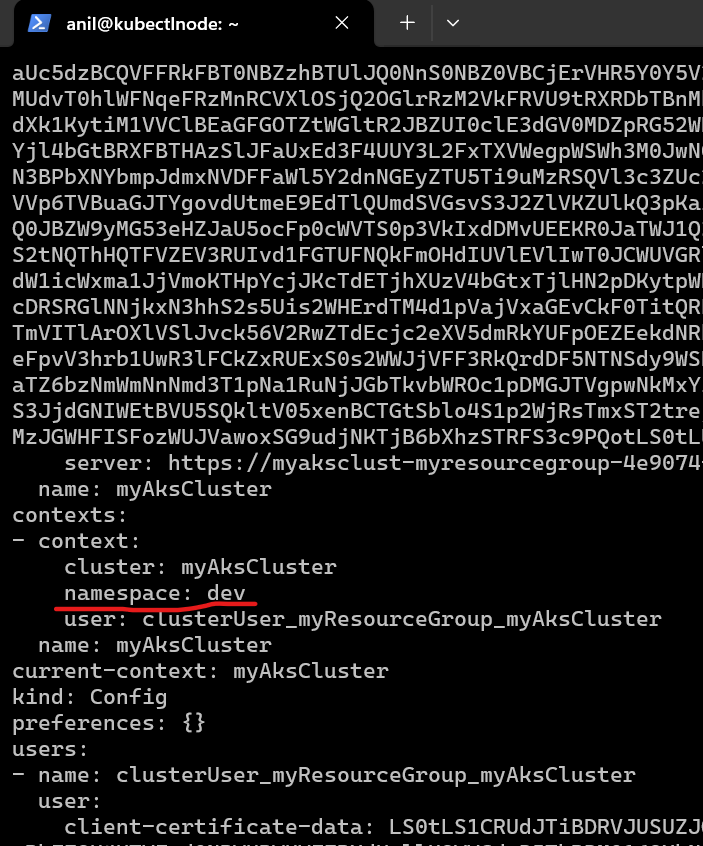

* because of we change default area given in below pic.
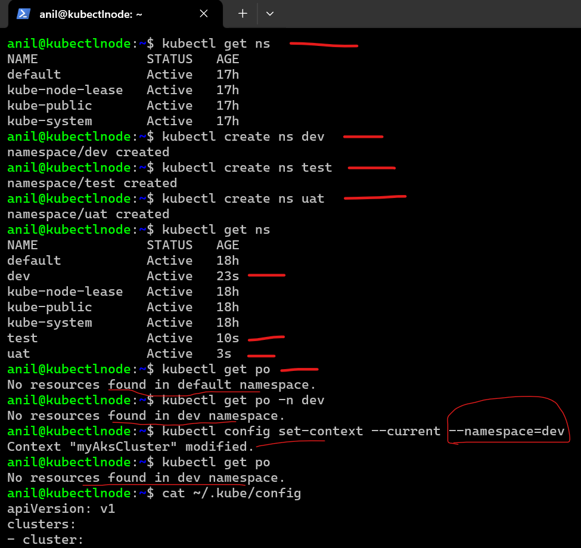

```
kubectl config set-context --current --namespace=dev
```     
#

* note: Generally namespace is an administration convinience, adding namespaces in yaml might not be a good practice. 

*   Lets deploy an nginx pods and a service in dev namespace. Refer Here for manifests

```
---
apiVersion: apps/v1
kind: Deployment
metadata:
  name: ns-deploy
  namespace: dev
spec:
  minReadySeconds: 30
  progressDeadlineSeconds: 600
  replicas: 2
  selector:
    matchLabels:
      app: nginx
  strategy:
    type: RollingUpdate
    rollingUpdate:
      maxSurge: 40%
      maxUnavailable: 40%
  template:
    metadata:
      labels:
        app: nginx
        ver: "v1.0"
    spec:
      containers:
        - name: nginx
          image: nginx
          resources:
            limits:
              cpu: 500m
              memory: 500Mi
          ports:
            - containerPort: 80

---
apiVersion: v1
kind: Service
metadata:
  name: nginx-svc
  namespace: dev
spec:
  selector:
    app: nginx
  ports:
    - name: nginx
      targetPort: 80
      port: 80
---
apiVersion: v1
kind: Namespace
metadata:
  name: dev
```
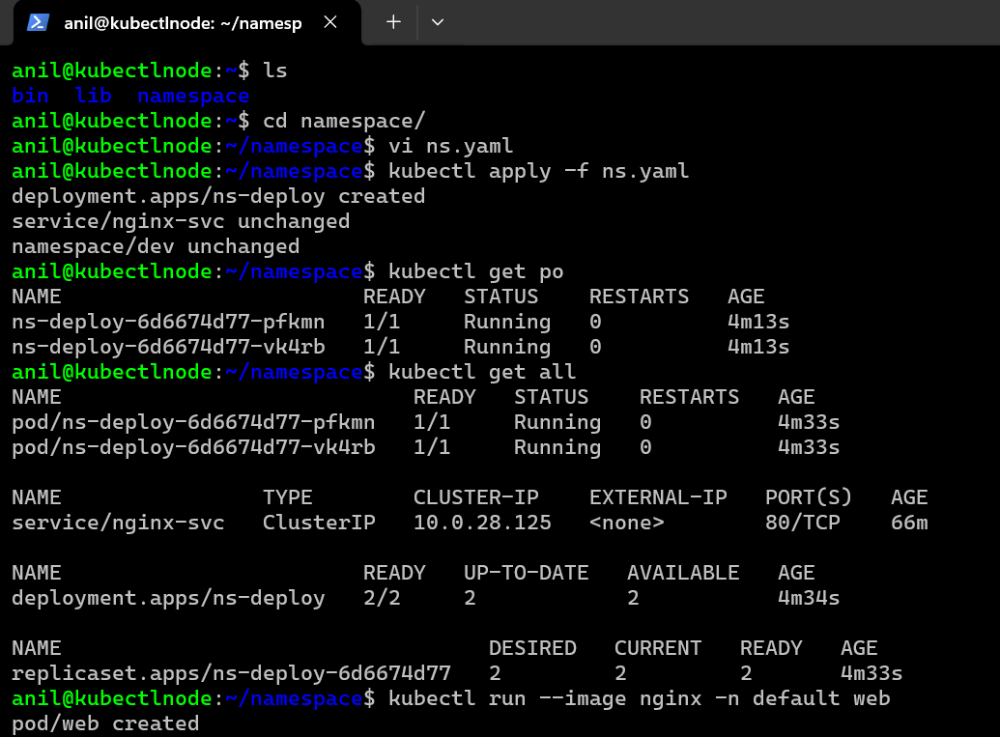
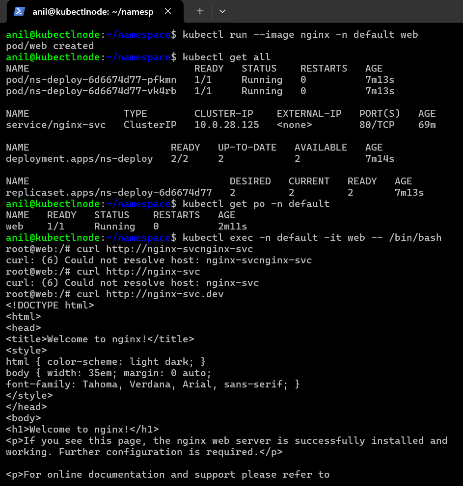
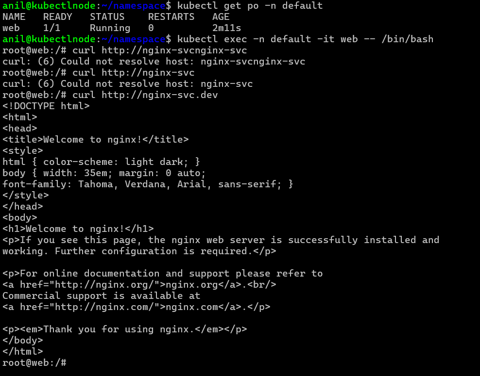


* Lets create an nginx pod in default namespace
``` 
kubectl run --image nginx -n default web 
```

* for namespace and dns
* refer: https://kubernetes.io/docs/concepts/overview/working-with-objects/namespaces/#namespaces-and-dns

* write namespaces yaml file is not a good idea coz tomrrow if you want to same objects to be deploy to a differnet env you have to change everytime yaml file 

* we know every gets a unique ip address but accessing by ip address isnot a good idea 

* __if 1 service wants to speak with other service if it is inside the same cluster give the name if inside the same namespace you can directlly give the name  and if it is in different namespace you have to give `.namespace name` .__

* __when you to communicate from pod in 1 namespace to the pod in other namespace kindly try to use of name of the namespace__

* if you want to stop the communication you have to use network policy.
  
* its speaks its searching in `search default.svc.cluster.local svc.cluster.local cluster.local yvb0u12mrtvepnf0nykpeckx5e.tx.internal.cloudapp.net`

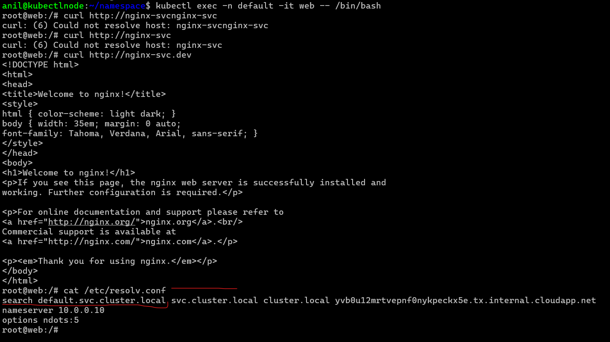

* # Namespaces:
  
```
Namespace
Namespace is a way to organize objects in a Kubernetes cluster into different groups. This helps manage and isolate resources. Think of it like creating different folders on your computer to store related files separately.

Why use namespaces?
Separation of environments: You can have different namespaces for development, testing, and production.
Resource management: Limits and quotas can be set for different namespaces.
Access control: Different users can be given access to different namespaces.
For example, you can have:

A namespace called dev for development.
A namespace called test for testing.
A namespace called prod for production.
```
# DNS (Domain Name System)

```
DNS in Kubernetes is used to convert the service names into IP addresses, making it easier to access services within the cluster.

Why use DNS?
Service discovery: DNS makes it easy to find and communicate with services in the cluster without needing to remember IP addresses.

Automatic updates: When a service IP changes, DNS records are updated automatically, so you always connect to the correct IP.

For example:

You have a service called `web-service` in the `dev` namespace.
Instead of using an IP address, you can access it using `web-service.dev.svc.cluster.local`.

# Summary

Namespace: Like folders on your computer, it helps organize and manage resources in a Kubernetes cluster.

DNS: Converts service names into IP addresses, making it easy to find and connect to services within the cluster.

These features help keep your Kubernetes environment organized and make it easier to manage and scale your applications.
```
* Lets try providing __Resource Quotas to Namespace__ 
* Refer Here: https://kubernetes.io/docs/concepts/policy/resource-quotas/

* # LimitRange : 
* refer: https://kubernetes.io/docs/concepts/policy/limit-range/

```
LimitRange is a feature in Kubernetes used to set default and maximum resource limits for containers in a namespace. It helps ensure that no single container uses too many resources and disrupts the overall performance of the cluster.

Why use LimitRange?

1] Resource Management: Prevents containers from using excessive CPU or memory.

2] Fair Resource Distribution: Ensures resources are fairly distributed among all containers.

3] Cluster Stability: Helps maintain cluster stability by avoiding resource exhaustion.

How it works:

Default Limits: Automatically applied to containers that do not specify their own resource limits.

Maximum Limits: Sets the upper limit on the amount of resources a container can request or consume.

Example:

Imagine you have a cluster with limited resources and you want to ensure no container can use more than 500m CPU and 1Gi of memory. You can create a LimitRange to enforce these limits.

Summary

LimitRange helps manage and control resource usage in a Kubernetes namespace.

It ensures no single container can use too many resources.

It sets default and maximum resource limits for containers.

By using LimitRange, you can maintain a stable and efficient Kubernetes environment, ensuring fair resource usage among all containers.
```

* # NetworkPolicy 
* refer: https://kubernetes.io/docs/concepts/services-networking/network-policies/

```
NetworkPolicy in Kubernetes

NetworkPolicy is like a set of rules that control how pods in a Kubernetes cluster can talk to each other and to the outside world. It's used to secure and manage network traffic.

Why use NetworkPolicy?

1] Security: It helps keep your pods safe by only allowing the right traffic to reach them.

2] Isolation: It makes sure that only specific pods can communicate with each other, which can help prevent problems if one pod gets compromised.

3]Traffic Control: It allows you to control and manage the flow of network traffic in your cluster.

How it works:

Ingress Rules: Control incoming traffic to the pods (who can talk to the pod).

Egress Rules: Control outgoing traffic from the pods (where the pod can send data).

Selectors: Use labels to specify which pods the policy applies to.

Example:

Imagine you have two types of pods: frontend and backend. You want to allow only the frontend pods to talk to the backend pods

Summary

NetworkPolicy: A way to set rules for how pods communicate in Kubernetes.

Ingress Rules: Control who can send traffic to your pods.

Egress Rules: Control where your pods can send traffic.

Selectors: Use labels to target specific pods.

Using NetworkPolicy helps you secure and control the network traffic in your Kubernetes cluster, ensuring that only the necessary communication happens between your pods.
```

* __who can not access your pod that's why we are using network policy.__
   
# what is ect/resolve.conf 

```
In Kubernetes, the /etc/resolv.conf file within a pod is configured to facilitate DNS resolution within the cluster. This file is automatically managed by Kubernetes to ensure that pods can resolve service names and communicate with other services within the cluster.

What is /etc/resolv.conf in Kubernetes?
Purpose: The /etc/resolv.conf file is used to configure DNS resolution for the pod. It contains information about DNS nameservers and search domains that Kubernetes uses to resolve service names to IP addresses.

Summary

Function: The `/etc/resolv.conf` file in a Kubernetes pod configures DNS resolution.

Nameservers: Typically point to the cluster's DNS service (e.g., CoreDNS).

Search Domains and Options: Help resolve service names within the cluster.

Automatic Management: Kubernetes sets up this file automatically when a pod is created, ensuring smooth internal service communicatio

This setup ensures that pods can easily discover and communicate with other services in the Kubernetes cluster using DNS, which is crucial for the operation and management of applications within the cluster.
```

# delete aks cluster 
`az aks delete --name myAKSCluster --resource-group myResourceGroup`