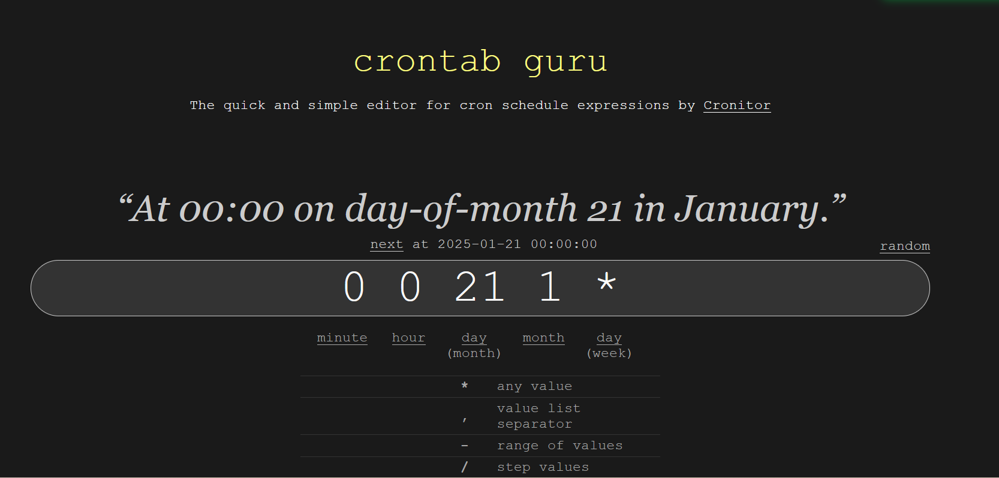
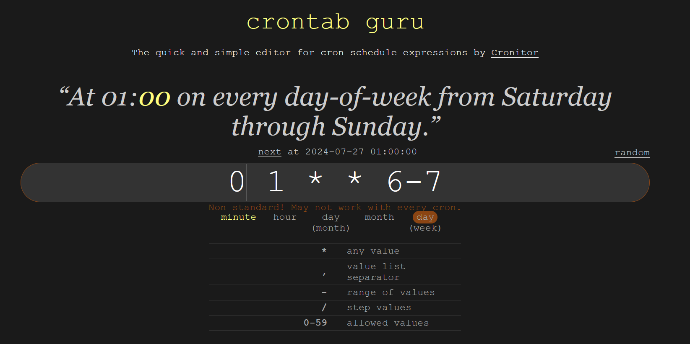
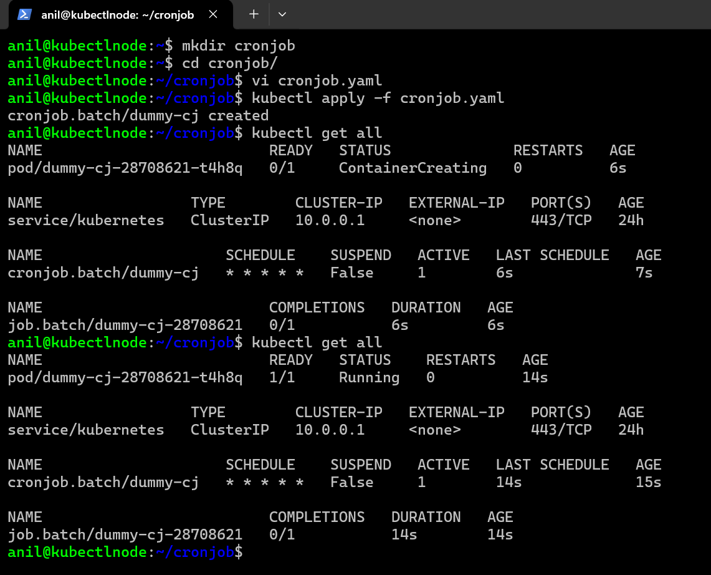
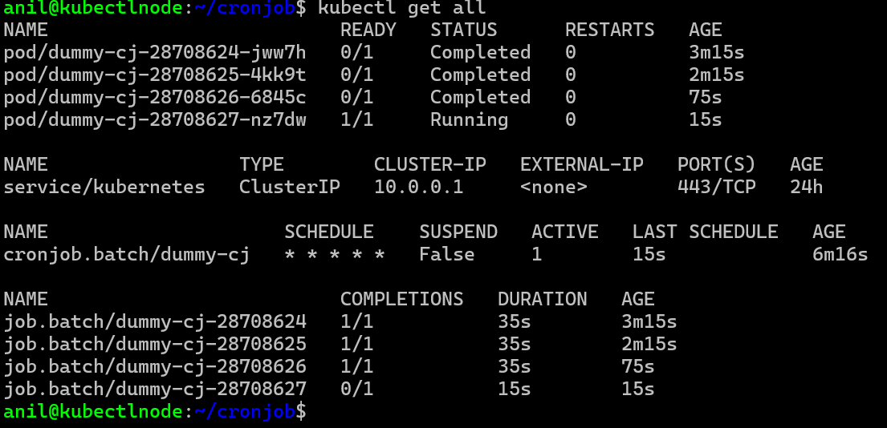
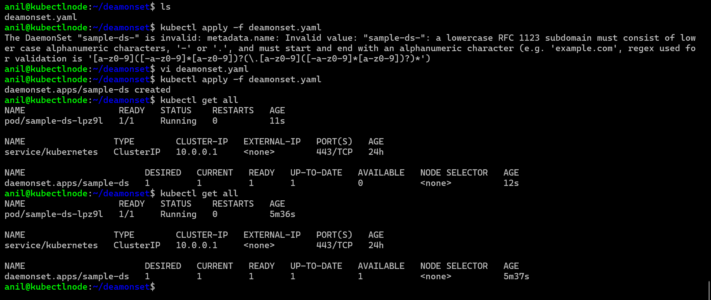
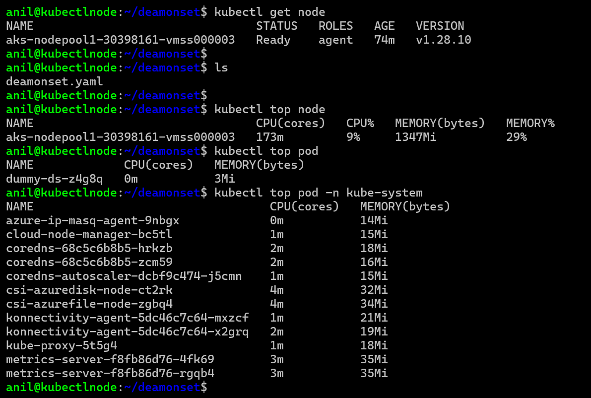
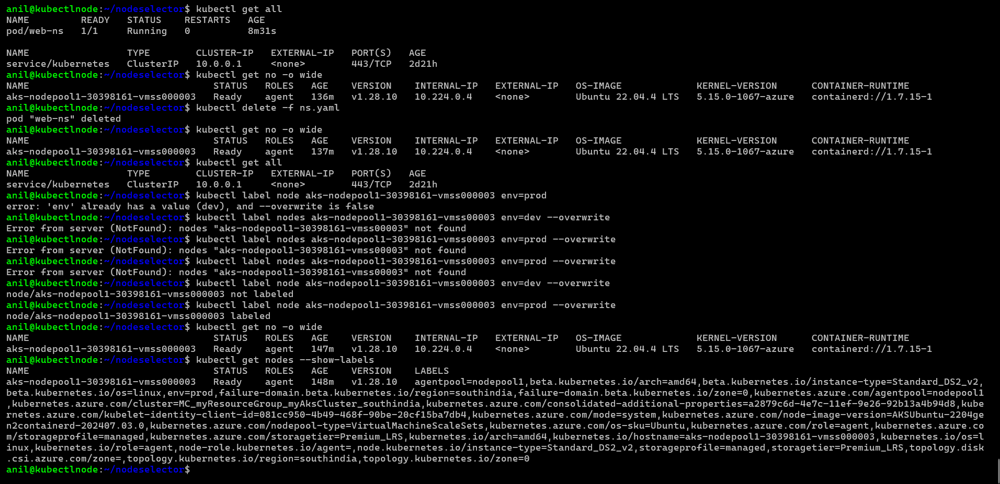
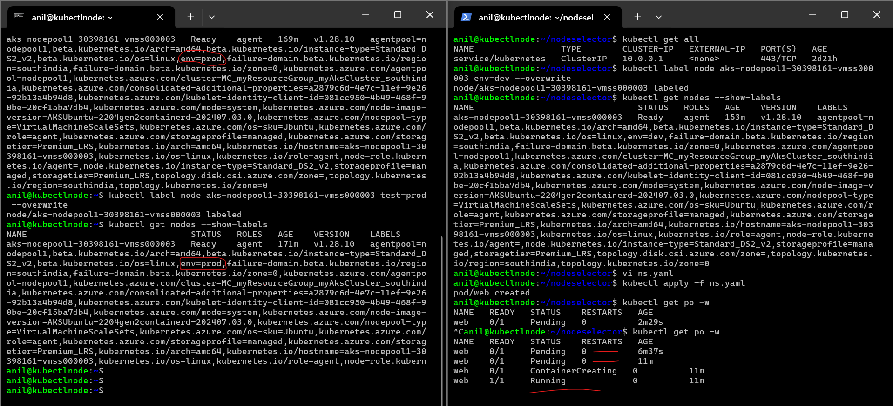

## Jobs and Cronjobs in kubernetes

* In enterprise grade application we have batch jobs (they running for sometime they go to the finish job) and scheduled jobs (everyday at specific time they do the job)
  
* For doing the above mentioned activites we have 
       * Job
       * Cronjob

* Here Job expects the Pod to get into Completed state (pod run the container, container has run sometime then its goes to exited state is  exit code is `0`) and  Cron Job schedule the Pod to execute on some schedule
* refer: https://kubernetes.io/docs/concepts/workloads/controllers/cron-jobs/

* Lets run a  cron job which runs every weekday at 1:00 AM which executes a container (sleep 300s)

* https://crontab.guru/ for  cron schedules





* This cronjob will run everyminutes 

```
---
apiVersion: batch/v1
kind: CronJob
metadata:
  name: dummy-cj
spec:
  schedule: "* * * * *"
  jobTemplate: 
    metadata: 
        name: dummy-job
    spec:
  
      template: 
        metadata:
          name: dummy-pod 
          labels:    
            app: job
        spec:
          restartPolicy: Never
          containers:
            - name: cronjob-ctr
              image: alpine
              args:
                - sleep
                - 30s

```
* This will run at 1am from monday to friday

```
---
apiVersion: batch/v1
kind: CronJob
metadata:
  name: dummy-cj
spec:
  schedule: "* 1 * * 1-5"
  jobTemplate: 
    metadata: 
        name: dummy-job
    spec:
  
      template: 
        metadata:
          name: dummy-pod 
          labels:    
            app: job
        spec:
          restartPolicy: Never
          containers:
            - name: cronjob-ctr
              image: alpine
              args:
                - sleep
                - 30s


```


* `kubectl delete cronjob.batch/dummy-cj`

* __k8s cronjob creates jobs, jobs create a pods, pods runs the container which will go into the completed state.__

* __Replicaset creats pods, Deployments create replicaset creates pod.__
  
* # Daemonsets

* `* Daemonsets is used to run an agent on nodes.`

* `A DaemonSet in Kubernetes is a type of controller that ensures a copy of a pod runs on all (or some) nodes in the cluster. This is particularly useful for deploying system-level applications, such as log collectors or monitoring agents, that need to run on every node.`

* # Key Points:
`Purpose: Ensure that specific pods run on every node.`
`Use Cases: System services, monitoring, logging, etc.`

* # Example:
  
* `__Suppose you want to deploy a log collection agent on every node in your Kubernetes cluster to gather logs for analysis. You can use a DaemonSet to achieve this.__`

* `When this DaemonSet is applied to your Kubernetes cluster, it will ensure that a pod running the log-collector container is present on each node. If you add more nodes to the cluster, the DaemonSet will automatically add the log-collector pod to those new nodes as well.`

* `* if you want to run an agent on inside the pod then it is a sidecar container. `

* `* if you want to run an inside agent on every node or some nodes then its became a daemonsets.`

* `* a pod can have many containers inside it, so inside that container the 1st container consider is maincar contaier and rest of the container is  sidecar containers.`

* `if you want to run an agent on inside the pod then it is a sidecar , agent on every node, some nodes that becomes a deamonsets`

* `in deployments we speak no. of replicas in deamonsets we will try to on which sets of nodes should i run the pod it is not about scaling its.`

```
---
apiVersion: apps/v1
kind: DaemonSet
metadata:
  name: sample-ds
spec:
  minReadySeconds: 10
  selector:
    matchLabels:
      app: ds
  template:
    metadata:
      labels:
        app: ds
        version: "v1.0"
    spec:
      containers:
        - name: ds-c
          image: nginx
```

* 
*  


* refer: https://kubernetes.io/docs/concepts/workloads/controllers/daemonset/

* Daemonsets support rolling updates
* Lets create a daemon set which runs on every node.


```

```

* __Note: Metrics Server Refer Here is an add-on in  k8s which is enabled in managed k8s where as in kube-adm that is additional installation__

```
kubectl top node
kubectl top pod
```


* # Scheduling pods in k8s

* Assigning pods to a node 
  
* Refer Here : https://kubernetes.io/docs/concepts/scheduling-eviction/assign-pod-node/

     * nodeSelector
     
     * # Affinity and Anti-Affinity
      
      * __Affinity__
          * Affinity means i want to run a pod B where pod A is running or i want to run a pod A where pod B is running 
      
      * __Anti-Affinity__
          * I dont want to run a pod where pod B or A is running
     
     * nodeName
     
     * taints and tolerations
     
     *  Resource Limits based (random)
  
* NodeSelector

* a pod is choosing node on which  has to run `nodeselector` 
  
* Lets start label the node 

* `kubectl label node aks-nodepool1-30398161-vmss000003 env=dev`

* if you want to change label name of node 
  
* `kubectl label node aks-nodepool1-30398161-vmss000003 env=prod --overwrite`

*  

```
---
apiVersion: v1 
kind: Pod 
metadata:
  name: web-ns
  labels:
    env: dev
spec:
  nodeSelector:
    test: prod
  containers:
    - name: ns-c
      image: nginx 
      ports: 
        - containerPort: 80
      resources:
        limits: 
          memory: "500Mi"
          cpu: "500m"

```
# 2nd 

```
---
apiVersion: v1
kind: Pod
metadata:
  name: web
  labels:
    name: web
    env: dev
spec:
  nodeSelector:
    test: prod
  containers:
  - name: web
    image: nginx
    resources:
      limits:
        memory: "128Mi"
        cpu: "500m"
    ports:
      - containerPort: 80


```



* # nodeName
* lets create a pod with nodeName

```
---
apiVersion: v1
kind: Pod
metadata:
  name: nodenamedemo
  labels:
    name: web
    env: dev
spec:
  nodeName: "aks-nodepool1-30398161-vmss000003"
  containers:
  - name: web
    image: nginx
    resources:
      limits:
        memory: "128Mi"
        cpu: "500m"
    ports:
      - containerPort: 80
```


-----------------------------------------------------------------------------------------------------------