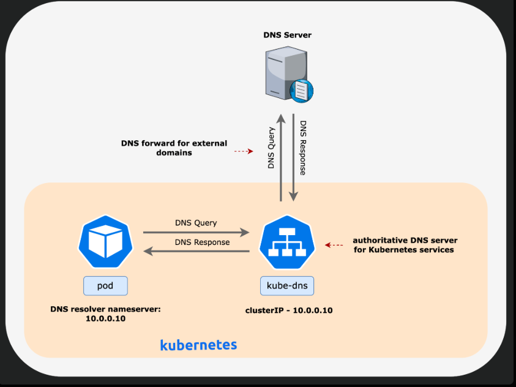

# Accessing applications in k8s

* Each Pod gets an IP Address, Pods get scaled an replaced, directly accesing pods by ip might not be a good idea

* K8s has a component running for service discovery with DNS functionality mostly coredns

# In linux machines we have /etc/resolve.conf whats the purpose of that?
 

Hey there! Imagine you're trying to find a specific house in a huge neighborhood, but you only have the person's name. That's where `/etc/resolv.conf` comes in handy on Linux computers[1][2].

Here's the breakdown:

*   **What it is:** `/etc/resolv.conf` is like a phonebook for the internet[1]. It's a simple text file that tells your computer how to translate website names (like google.com) into the numerical addresses (IP addresses) that computers use to communicate[1][2].

*   **Why it's needed:** When you type a website name into your browser, your computer needs to find the correct server on the internet. It does this by asking a Domain Name System (DNS) server for the IP address associated with that name[1]. The `/etc/resolv.conf` file tells your computer which DNS servers to ask[1][3].

*   **What's inside:** The file usually contains a few important things[1]:
    *   `nameserver`: This line lists the IP addresses of DNS servers your computer can use. You can have multiple nameservers listed, and your computer will try them in order[1][5].
    *   `search`: This line lists domain names that will automatically be added to short hostnames. For example, if the search list contains "example.com" and you try to access "web", your computer will automatically try to access "web.example.com"[1][6].

*   **How it works:** When your computer tries to access a website, it first checks `/etc/resolv.conf` to find the IP addresses of DNS servers[9]. It then asks those servers for the IP address of the website. Once it gets the IP address, your computer can connect to the website[1].

*   **Who manages it:** Usually, this file is set up automatically when you connect to a network, like your home Wi-Fi. Your Internet Service Provider (ISP) gives your computer the addresses of their DNS servers, and your computer puts them in `/etc/resolv.conf`[2]. Sometimes, you might need to change it yourself, but usually, it's taken care of for you[1][7].

* 
So, in short, `/etc/resolv.conf` is a crucial file that helps your computer find its way around the internet by translating website names into IP addresses.
 # or 

*   The /etc/resolv.conf file is a plain-text configuration file that specifies how the Domain Name System (DNS) resolver operates on a system[1]. It contains information that allows applications to translate human-friendly domain names into the numerical IP addresses needed to access resources on a network or the internet[1]. This translation process is known as address resolution[1]. The file is typically located in the /etc directory[1].

* The resolv.conf file is used to configure hostname resolution and is commonly used to manage DNS requests on Linux systems[2]. It can be manually configured by a system administrator or automatically populated by network configuration and management tools[2].

Key purposes and functions:
---------------------------

* Nameserver specification The nameserver directive specifies the IP addresses of domain name servers that the resolver can query[1][5]. Multiple nameserver lines can be specified, but each line should only have one IP address, up to a maximum of three[2][5]. The resolver queries the DNS servers in the order listed[2]. If no nameserver entries are present, it defaults to 127.0.0.1[2].

* Search domains The search directive specifies default search domains that are used to complete a given query name to a fully qualified domain name when no domain suffix is supplied[1]. For example, search example.com local.test configures the resolver to try somehost.example.com and somehost.local.test[1].

* Lookup order The /etc/nsswitch.conf file specifies the lookup order for hostnames, determining whether the system consults DNS or the /etc/hosts file first[3].

In systemd-based Linux distributions, /etc/resolv.conf is often a symbolic link to /run/systemd/resolve/stub-resolv.conf[1]. The resolvconf program on FreeBSD and other Unix systems manages the resolv.conf file[1]. On Debian systems, both openresolv and resolvconf can be used to control the alteration of /etc/resolv.conf by networking programs[4].

* `sample /etc/resolve.conf in a container running in a Pod`




* Name resolving can be enabled with services and service acts a layer 4 load balancer

* Each Service gets an ip address, But this is an virtual ip which means it never changes till you kill the service

# Service 
    
  * https://kubernetes.io/docs/concepts/services-networking/service/

* Service type 
  
  * For some parts of your application (for example, frontends) you may want to expose a Service onto an external IP address, one that's accessible from outside of your cluster.

    * Kubernetes Service types allow you to specify what kind of Service you want.

* The available type values and their behaviors are:

type: ClusterIP :
-----------------
   * Exposes the Service on a cluster-internal IP. Choosing this value makes the Service only reachable from within the cluster. This is the default that is used if you don't explicitly specify a type for a Service. You can expose the Service to the public internet using an Ingress or a Gateway.

type: NodePort :
-----------------
   * Exposes the Service on each Node's IP at a static port (the NodePort). To make the node port available, Kubernetes sets up a cluster IP address, the same as if you had requested a Service of type: ClusterIP.

type: LoadBalancer :
--------------------
   * Exposes the Service externally using an external load balancer. Kubernetes does not directly offer a load balancing component; you must provide one, or you can integrate your Kubernetes cluster with a cloud provider.

type: ExternalName :
--------------------
   * Maps the Service to the contents of the externalName field (for example, to the hostname api.foo.bar.example). The mapping configures your cluster's DNS server to return a CNAME record with that external hostname value. No proxying of any kind is set up.
The type field in the Service API is designed as nested functionality - each level adds to the previous. However there is an exception to this nested design. You can define a LoadBalancer Service by disabling the load balancer NodePort allocation.


* In summary, the diagram illustrates the following:

* A client sends a request to the web-svc service (IP 192.168.0.15, port 80).

* The web-svc service load balances the traffic across three backend Pods.

* Each Pod has a unique IP address (192.168.1.4, 192.168.2.4, 192.168.3.4) and receives traffic on port 80.

* This is a typical setup for a stateless application running in Kubernetes. The service provides a single point of access, and Kubernetes ensures that traffic is distributed across the available Pods. The FQDN allows other services within the cluster to easily discover and communicate with the web-svc service using DNS. The use of a Kubernetes Service abstracts away the individual pod IP addresses from the client.

* The "namespace" component of the fqdn is important: Kubernetes provides a flat network namespace, and services can be named the same across different namespaces, hence you need the namespace as part of the fqdn to address the service uniquely and ensure that all kubernetes components can find it.

* Service in k8s can be of following types

    * Cluster IP: This is an internal ip address which works within k8s cluster

    * Node Port: The service is exposed on every node in k8s cluster on a specific port

    * Load Balancer: This generally works with cloud services, this creates a cloud native load balancer (rule)

    * External Name: This is used for DNS records to be used externally

Port Defination
------------------

 * refer: https://kubernetes.io/docs/concepts/services-networking/service/#field-spec-ports


* Port definitions in Pods have names, and you can reference these names in the targetPort attribute of a Service. For example, we can bind the targetPort of the Service to the Pod port in the following way:

```yaml

```
# Lets expose httpd containers using service

* Lets run the replicaset to create 5 pods of httpd
* lets create an internal service i.e. type is ClusterIP 

```yaml
apiVersion: v1
kind: Service
metadata:
  name: httpd-svc
spec:
  type: ClusterIP
  selector:
    app: apache
  ports:
    - port: 80
      targetPort: 80
      protocol: TCP
```

* Now lets create one more service with type Node Port

```yaml
apiVersion: v1
kind: Service
metadata:
  name: my-service
spec:
  type: NodePort
  selector:
    app.kubernetes.io/name: MyApp
  ports:
    - port: 80
      # By default and for convenience, the `targetPort` is set to
      # the same value as the `port` field.
      targetPort: 80
      # Optional field
      # By default and for convenience, the Kubernetes control plane
      # will allocate a port from a range (default: 30000-32767)
      nodePort: 30007
```


* https://directdevops.blog/2025/02/16/devops-classroom-notes-16-feb-2025/

